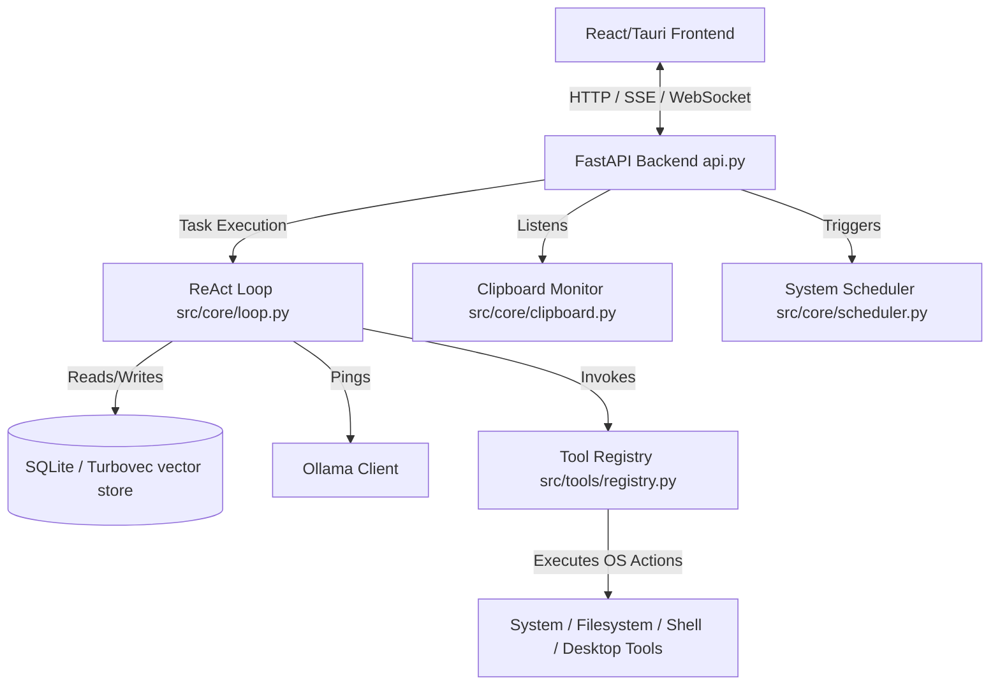

# Meridian-X — Developer Guidelines

Welcome to the Meridian-X codebase! This document outlines module boundaries, developer conventions, and the architecture of the engine.

---

## 1. High-Level Architecture

Meridian-X uses a decoupled architecture with a Python FastAPI backend acting as the core ReAct agent loop, and a React + Tauri frontend providing the desktop environment and system trays.



---

## 2. Module Boundaries

To maintain clean separation of concerns and avoid circular dependencies:
- **`src/core`**: Core workflow engines (loop, proactive intelligence, LLM connection, p2p, event bus). Avoid importing endpoints from `api.py` into core files.
- **`src/tools`**: Independent tool execution blocks. They must be registered in `src/tools/registry.py` and remain stateless. All system/filesystem operations MUST be logged to the audit log.
- **`src/voice`**: Audio captures, STT (Whisper), and TTS (speech synthesis) engines.
- **`database.py`**: Singleton helpers for SQLite, MongoDB, and Turbovec. Use connection-pooling/timeout patterns to avoid locks.

---

## 3. Design Patterns & Best Practices

All new code additions must adhere to the following architectural guidelines:

### A. Defensive Error Handling
Wrap OS-level interactions and network queries in `try-except` blocks. Never allow a tool or background thread failure to bubble up and crash the backend process.
```python
# Bad
def delete_tmp():
    os.remove("temp.txt")

# Good
def delete_tmp():
    try:
        if os.path.exists("temp.txt"):
            os.remove("temp.txt")
            return "Success"
        return "File not found"
    except Exception as e:
        logger.error(f"Failed to delete temp file: {e}")
        return f"Error: {e}"
```

### B. Use Structured Logging & Audit Logs
- Use `logging.info()` or `logging.warning()` instead of plain `print()` statements for general logging.
- Call `log_sensitive_action` from `src.core.audit_logger` inside files modifying systems, run CLI tasks, write files, or trigger keyboard/mouse operations.
```python
from src.core.audit_logger import log_sensitive_action

log_sensitive_action(
    category="FILE_WRITE",
    action="write_config",
    details={"path": config_path},
    status="SUCCESS"
)
```

### C. Async Safety & Event Loop Binding
When interacting with the database or triggering local network connections in threads/async contexts, verify the thread is bound to the loop correctly.
- Do not instantiate asyncio queues outside an active event loop.
- Use `asyncio.to_thread` for blocking operations (like standard sync filesystems or Ollama generation) inside the async ReAct stream.
