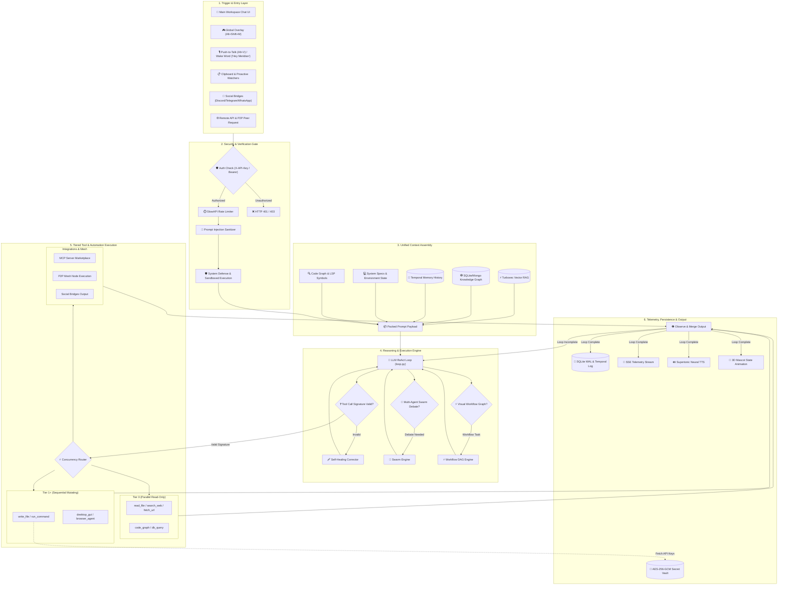

# MERIDIAN-X SYSTEM ARCHITECTURE & TECHNICAL CONTEXT DOCUMENT

> **Target Audience**: AI Agents, Technical Automation Parsers & Developers  
> **Version**: `v0.1.5`  
> **Last Updated**: `2026-10-01`  
> **Repository Roots**:  
> Core Application: `c:/Users/aryan/OneDrive/Dokumen/Mini_Project/Meridian-X`  
> Website/Marketing: `c:/Users/aryan/OneDrive/Dokumen/Mini_Project/meridian_website`  

---

## 1. PROJECT OVERVIEW & TECHNOLOGY STACK

- **Name**: Meridian-X
- **Type**: Agentic Desktop Workspace Companion, Autonomous ReAct Engine & Multi-Agent Ecosystem
- **OS Support**: Windows 11 (64-bit), macOS 12+ (Apple Silicon/Intel), Linux (Ubuntu/Debian/Arch/Fedora)
- **Frontend Stack**: Tauri v2, React 19, TypeScript, Vite, Three.js (3D Mascot), Anime.js, Tailwind CSS v4, Lucide Icons, Glassmorphism Tokens
- **Mobile Stack**: Flutter (Android, iOS, macOS, Linux, Windows), Resilient WebSocket Client (`/ws`, `/api/ws/mobile`), Live Activity Stream
- **Backend Stack**: Python 3.10+, FastAPI (Modular `src/api/` Routers), Uvicorn, SlowAPI, Pydantic v2, PyInstaller
- **Inference Layer**:
  - Local LLMs via Ollama (`Llama 3.2`, `Llama 3.1`, `Qwen 2.5`, `Mistral`) with Quantization Selection (`Q4_K_M`, `Q4_0`, `Q5_K_M`, `Q8_0`, `F16`)
  - Cloud Providers (OpenAI, Anthropic, Gemini, Groq, OpenRouter, DeepSeek)
- **Storage & RAG Layer**: Turbovec (Sub-ms Vector RAG), SQLite WAL (`database.py`), MongoDB (Graph RAG Sync), Temporal Graph Engine, Cognitive Graph (`src/core/cognitive_graph.py`)
- **Voice Engine**: Supertonic local TTS (10 voices), Faster-Whisper local STT, OpenWakeWord ONNX Engine ("Hey Meridian")
- **Automation & Integration**: BrowserUseAgent (Set-of-Marks visual DOM indexing), Model Context Protocol (MCP), Playwright Web Agent, Desktop GUI Macros, LSP Code Server, P2P Mesh Network, Standalone Resilient Bridge Daemon (Port 4133)

---

## 2. COMPLETE FEATURE & CAPABILITY MATRIX

### 🧠 Autonomous ReAct Reasoning Engine

- Asynchronous **Reason -> Act -> Observe** iterative loop modularized into dedicated execution components (`loop.py`, `loop_dispatcher.py`, `loop_parser.py`, `loop_stream.py`, `loop_executor.py`, `loop_planning.py`).
- **Safety Gate & Confirmation Checkpoints**: Interactive confirmations for Tier >= 1 mutating actions with rollback checkpoints (`confirmations.py`, `checkpoints.py`).
- **Consensus Debate Gating Engine** (`consensus_engine.py`): Adversarial multi-agent debate gating automatically triggered for complex, destructive, or ambiguous plans prior to execution.
- **Cognitive Graph & Code Intelligence**: Live AST symbol reference graph (`cognitive_graph.py`) and automated git reviewer (`auto_reviewer.py`).
- **Self-Healing Parameter Engine**: Automatically catches tool schema signature mismatches against `TOOL_REGISTRY` and re-injects corrected arguments.
- **Code Auditor Model**: Secondary model checks Python/JSON execution blocks for logic and security bugs prior to execution.
- **Live SSE Streaming**: Telemetry streams thought process (`PLANNING`, `EXEC`, `STATUS`, `WARNING`, `SUGGESTION`) in real time to UI via Server-Sent Events.

### 🚀 Non-Techie Onboarding Wizard

- **Hardware Spec Detection** (`hardware_detector.py`): Checks system CPU cores, RAM, and NVIDIA VRAM (`pynvml`) to classify machine into `Entry` (<8GB), `Mid` (8-16GB), or `High` (>16GB) tier.
- **Ollama Auto-Discovery & Multi-Port Scan** (`ollama_manager.py`): Scans ports `11434`, `11435`, `8080`, `5000` and `PATH` binaries without requiring manual host configuration.
- **Real-Time Model Puller**: Streams `ollama pull <model>` percentage via SSE directly inside setup modal (`OnboardingWizard.tsx`).

### 👥 Multi-Agent Swarm & Debate Engine

- Multi-perspective autonomous debate between customized agent personas (`swarm.py`, `SwarmDebate.tsx`).
- Parallel agent reasoning synthesis for complex problem-solving and adversarial consensus validation.

### ⚡ Visual Workflow & DAG Engine

- Node-based visual automation graph builder (`workflow_engine.py`, `WorkflowBuilder.tsx`).
- Sequential and conditional execution DAGs combining LLM steps, shell scripts, API calls, and watcher triggers.

### 🌐 P2P Mesh Network & Encrypted Peer Offloading

- Distributed peer-to-peer node discovery and handshake (`p2p.py`, `p2p_crypto.py`).
- End-to-end encrypted task offloading between trusted LAN/WAN Meridian-X nodes.

### 📚 Combined Vector RAG & Knowledge Graph

- Sub-millisecond vector indexing using Turbovec engine (`rag_optimizer.py`).
- Entity-relationship Knowledge Graph synchronized across SQLite WAL and optional MongoDB (`graph_rag.py`, `graph_sync.py`).
- Automated document chunking, indexing, and context synthesis (`doc_indexer.py`, `doc_generator.py`).

### 🎙️ Full Duplex Voice & Wake-Word Engine

- Hands-free ONNX wake-word listener for "Hey Meridian" (`wakeword.py`).
- Real-time continuous speech-to-text with Faster-Whisper (`stt.py`) and 10-voice neural text-to-speech with Supertonic (`tts.py`, `duplex.py`).

### 🔍 Code Graph & LSP Client Engine

- Language Server Protocol integration for deep code AST analysis, symbol references, and type checking (`lsp_client.py`, `code_graph.py`).
- Automated code quality reviewer and lint verification (`auto_reviewer.py`).

### 📱 Subagent, Plugin SDK & Mobile Companion Infrastructure (Day 14)

- **Heterogeneous Subagent Model Binding (`PL-10`)**: Role-based LLM binding (`gemini-1.5-flash` for Researcher, `deepseek-coder` for Auditor/Bug Fixer, `claude-3-5-sonnet` for Browser/Planner) in `swarm.py`.
- **Mobile QR Companion Pairing & Mesh Sync (`ECO-01`, `OPS-02`)**: QR pairing token secret exchange, mobile voice/video stream ingestion, and mDNS gossip delta-sync across Desktop and Mobile nodes (`p2p.py`, `api.py`).
- **Butler Skill Plugin SDK (`OPS-03`)**: Manifest verification, signature check, permission sandboxing, and developer SDK documentation (`plugins.py`, `docs/PLUGIN_SDK.md`).
- **WhatsApp Voice Call Bridge (`CALL-05`)**: Playwright session voice call automation, transcript recording, and call intelligence synthesis (`whatsapp_manager.py`).

### 🩺 Health, Wellness & Daily Rhythm Butler (Day 15)

- **Wearable Health Ingestion (`FIT-01`)**: Sync step count, sleep duration, resting heart rate, and active calories from Google Fit / Apple Health into morning briefing (`health_ingest.py`).
- **Wellness & Ergonomics Butler (`BUTLER-03`)**: Posture reminders, 20-20-20 eye-strain breaks, hydration tracking, and daily holistic wellness score calculation (`wellness.py`).
- **Evening Wind-Down & Daily Review (`BUTLER-07`)**: End-of-day digest synthesizing completed tasks, git diff changes, focus metrics, and shutdown-ritual preset (`proactive.py`).
- **Voice Thought Bucket (`BUTLER-25`)**: Instant voice thought capture, keyword auto-tagging, and temporal decay RAG resurfacing (`temporal_memory.py`).
- **Memory Time Machine (`BUTLER-26`)**: Encrypted AES-256 point-in-time snapshots of SQLite DB, secrets vault, and temporal memory graphs with one-click restore (`memory_backup.py`).

### 🤖 Social & Communication Bridges

- Out-of-the-box bidirectional bot integrations for Discord (`discord_bridge.py`), Telegram (`telegram_bridge.py`), and WhatsApp (`whatsapp_manager.py`).

### ⏱️ Proactive Watchers, Triggers & Background Scheduler

- **Modular Proactive Intelligence Suite** (`src/core/proactive/`):
  - `predictive_engine.py`: Proactive context pre-warmer fetching relevant git diffs, RAG items, and tool dependencies before prompts are processed.
  - `presence_briefing.py`: Camera presence & desk arrival detector triggering spoken/visual morning and return briefings.
  - `commit_whisperer.py`: Detects logical unit-of-work boundaries in git repositories and proposes commit messages.
  - `what_broke_detective.py`: Autonomous test failure and regression analysis with suggested remediation diffs.
  - `proactive_system_guard.py`: Background system resource watchdog, memory leak auto-healer, and cleanup coordinator.
  - `silent_workflow_guardian.py`: File system watcher alerts (`watcher.py`, `triggers.py`).
  - `self_evolving_tooling.py`: Recurring action sequence tracker proposing automated macro shortcuts.
  - `tool_regression_sentinel.py`: Continuously audits tool matching heuristics and parameter mappings.
- Scheduled CRON and interval task executor (`scheduler.py`, `task_scheduler.py`).

### 🖥️ Desktop & Autonomous "Browser-Use" Engine

- **BrowserUseAgent** (`src/tools/browser_use_agent.py`):
  - Primary default browser automation engine running multi-step reasoning loops in visible browser windows.
  - **Set-of-Marks DOM Indexing**: Generates numbered visual badges `[1..N]` over all interactive elements for robust LLM element referencing.
  - **Engine Fallback Cascade**: Playwright Chromium -> Google Chrome -> Microsoft Edge -> system binary fallback.
  - Auto-recovers broken contexts, supports direct index actions (`click`, `type`, `press_key`, `scroll`, `wait`), and synthesizes structured web findings.
- GUI desktop interaction, mouse/keyboard macro recording and playback (`desktop.py`, `recording.py`).

### ⏳ Temporal Memory & History Rollback

- Granular conversation session state snapshots and time-travel rollback (`temporal_memory.py`, `history_manager.py`, `Timeline.tsx`).
- Exportable chat sessions and historical task telemetry log.

### 🎨 Local Studio & Model Management

- Management interface for local GGUF / Ollama models (`LocalStudio.tsx`, `ollama_manager.py`).
- Real-time performance metrics, VRAM usage tracking, and model switching.

### 🌐 Remote Backend & Self-Hosting

- **Docker Stacks**: Standard `docker-compose.yml` (direct IP) and production `docker-compose.prod.yml` (automated Caddy SSL reverse proxy).
- **Deployment Guide**: Comprehensive step-by-step setup documentation in [`docs/SELF_HOSTING.md`](docs/SELF_HOSTING.md).
- **Multi-Backend URL Switcher** (`ServerConnectionModal.tsx` & `config.ts`): User configures remote server URL (`MERIDIAN_REMOTE_BACKEND_URL`) and authorization API key (`MERIDIAN_REMOTE_API_KEY`) stored in `localStorage`.

### 🔐 Encrypted Secret Vault

- AES-256-GCM credential vault (`vault.py`) tied to machine hardware passphrase derivation (`hostname + username + salt`).
- Manages keys for OpenAI, Anthropic, Gemini, Groq, DeepSeek, Tavily, Discord, Telegram, and custom webhooks.

### 🔌 MCP (Model Context Protocol) Integration

- **Server Marketplace**: Dynamic tool registration for PostgreSQL, GitHub, Linear, and Slack MCP servers (`mcp_client.py`).
- **Reverse MCP Server**: Exposes Meridian-X's internal tool registry (`TOOL_REGISTRY`) as an MCP server at `/api/mcp/v1/tools` for external IDE consumption.

### ⚡ Speculative Concurrency Router

- **Tier 0 Read-Only Tools** (`read_file`, `list_directory`, `search_web`): Executed concurrently via `asyncio.gather()`.
- **Tier >= 1 Mutating Tools** (`write_file`, `run_command`, `gui_click`): Executed sequentially inside transactional safety gates.

### 🛡️ Enterprise Security Gateways (`SEC-01` to `SEC-26`)

- `X-API-Key` Auth dependency (`require_api_key`).
- `SlowAPIMiddleware` rate-limiting (20 req/min chat, 10 req/min vault).
- Prompt Injection Sanitizer stripping jailbreaks and hidden unicode exploits (`prompt_injection.py`).
- System Defense Shield and Sandboxed Execution Runner (`system_defense.py`, `sandbox_runner.py`).
- `MERIDIAN_ALLOW_HOST_CODE_EXEC` environment flag gating local terminal command execution.

### 📋 Clipboard Surveillance & Focus Shield

- 50-slot persistent clipboard history listener (`clipboard.py`).
- Distraction Blocker blocking distracting URLs (`YouTube`, `Reddit`, `Twitter`) and background processes (`discord.exe`, `steam.exe`).

### 🦊 Interactive Mascot & Frameless HUD

- Three.js 3D orbital-ring mascot reflecting AI cognitive state (Blue = Idle, Amber = Working, Red = Error, Green = Success).
- Global shortcuts: `Alt+M` (Toggle Workspace), `Alt+Shift+M` (Toggle Mascot Island), `Alt+V` (Push-to-Talk Voice).

### 🌉 Standalone Resilient Bridge Architecture (Port 4133)

- **Decoupled Background Service** (`mobile_bridge_service.py`):
  - Runs independently from the primary UI/FastAPI process on port 4133.
  - Maintains persistent WebSocket connections with the Flutter Mobile Companion and Bot listeners (Discord, Telegram).
  - Guarantees zero-crash, continuous connectivity even when desktop window closes or main backend reloads.

### 🧩 Lazy Butler Skills SDK & Registry Pruning

- **Lazy Skill Directory Pattern** (`plugins/<skill>/SKILL.md` + `tools.yaml`):
  - Specialized tools (`bills`, `expiry`, `travel`, `finance`, `home`, `health`, `geo`, `hardening`) converted to lazy skills.
  - On-demand injection into agent context via `classify_mode()`.
  - Keeps base `TOOL_REGISTRY` sleek (<70 core tools) while expanding capability breadth.

### 🎨 Expanded Design System & Theme Engine

- Added curated visual themes: **Tokyo Night Minimalist**, **Pure OLED Black**, and **VS Code Dark Pro**.
- Dynamic custom accent color picker and frosted glassmorphic card overlays.

---

## 3. FULL SYSTEM DATAFLOW & WORKFLOW GRAPH



---

## 4. REST API ENDPOINTS SPECIFICATION

| Endpoint | Method | Params / Body | Description |
| :--- | :--- | :--- | :--- |
| `/api/health` | `GET` | None | Returns system health, version, and background daemon status |
| `/api/diagnostics` | `GET` | None | Detailed system diagnostic report and system resource usage |
| `/api/system-usage` | `GET` | None | Real-time CPU, RAM, and GPU VRAM consumption metrics |
| `/api/onboarding/hardware-spec` | `GET` | None | Returns CPU cores, RAM GB, GPU VRAM, and model tier classification |
| `/api/onboarding/ollama-status` | `GET` | None | Scans ports & PATH for active Ollama service and installed models |
| `/api/onboarding/models/pull` | `POST` | `{ "model_name": str }` | Streams `ollama pull` progress percentage via SSE event stream |
| `/api/chat` | `POST` | `{ "prompt": str, "model": str }` | Standard synchronous chat endpoint |
| `/api/chat/stream` | `POST` | `{ "prompt": str, "model": str }` | Executes ReAct loop and streams thought events via SSE |
| `/api/chat/confirm` | `POST` | `{ "id": str, "approved": bool }` | Resolves safety gate confirmation prompt for Tier 2 mutating actions |
| `/api/chat/history` | `GET` | None | Fetches conversation memory history |
| `/api/chat/clear` | `POST` | None | Clears active chat conversation buffer |
| `/api/swarm/stream` | `GET` / `POST` | `{ "topic": str, "agents": list }` | Streams multi-agent swarm debate deliberation via SSE |
| `/api/proactive/stream` | `GET` | None | Real-time SSE stream of proactive agent recommendations |
| `/api/watcher/start` | `POST` | `{ "path": str, "rule": str }` | Starts file system watcher trigger |
| `/api/watcher/stop` | `POST` | `{ "watcher_id": str }` | Stops active file system watcher |
| `/api/watcher/list` | `GET` | None | Lists running file system watchers |
| `/api/scheduler/runs` | `GET` | None | Retrieves history of scheduled job executions |
| `/api/scheduler/create` | `POST` | `{ "cron": str, "task": str }` | Schedules automated recurring background task |
| `/api/history/rollback` | `POST` | `{ "snapshot_id": str }` | Rolls back workspace state to historical snapshot |
| `/api/rag/ingest` | `POST` | `{ "text": str, "metadata": dict }` | Ingests raw text into Turbovec vector RAG |
| `/api/rag/ingest-file-upload` | `POST` | File Upload | Uploads and indexes PDF/TXT/MD document into RAG & Knowledge Graph |
| `/api/rag/search` | `POST` | `{ "query": str, "top_k": int }` | Queries hybrid vector and graph RAG memory |
| `/api/tts` | `POST` | `{ "text": str, "voice": str }` | Synthesizes voice audio using Supertonic TTS |
| `/api/voice/onnx-models` | `GET` | None | Lists available ONNX voice models and wake-word configurations |
| `/api/vault/keys` | `POST` | `{ "provider": str, "key": str }` | Encrypts API credential into AES-256-GCM vault |
| `/api/security/rotate-key` | `POST` | None | Rotates system authorization key and updates encrypted vault |
| `/api/sandbox/run` | `POST` | `{ "code": str, "language": str }` | Executes code snippet inside isolated sandbox runner |
| `/api/profile/save` | `POST` | Profile JSON dict | Saves persistent settings to SQLite database |
| `/api/profile/all` | `GET` | None | Fetches all stored user settings and configuration keys |
| `/api/mcp/v1/tools` | `GET` | None | Returns reverse MCP server tool schemas for IDE consumption |
| `/api/mcp/config` | `GET` / `POST` | Config JSON | Reads or updates external MCP marketplace configuration |
| `/api/metrics` | `GET` | None | Prometheus telemetry metrics (request latency, CPU/RAM usage) |
| `/ws` / `/api/ws/mobile` | `WebSocket` | `{ "type": str, "content": Any }` | Full-Duplex mobile bridge connection for Flutter companion |
| `/api/workspace/summary` | `GET` | None | Workspace git state, active branch, and modified files summary |
| `/api/models/quantizations` | `GET` | `{ "model": str }` | Returns available quantization options (`Q4_K_M`, etc.) |
| `/api/memory/consolidate` | `POST` | `{ "session_id": str }` | Triggers autonomous conversation summarization and cognitive graph sync |

---

## 5. LOCAL STORAGE & ENVIRONMENT KEYS REFERENCE

| Storage / Env Key | Type | Description |
| :--- | :--- | :--- |
| `MERIDIAN_ONBOARDED` | `localStorage` | `'true'` if initial non-techie onboarding completed |
| `MERIDIAN_REMOTE_BACKEND_URL` | `localStorage` | Custom remote server target URL override (e.g. `https://api.my-server.com`) |
| `MERIDIAN_REMOTE_API_KEY` | `localStorage` | Custom authorization API key for remote backend |
| `MERIDIAN_MODEL` | `localStorage` | Selected offline/cloud LLM model ID |
| `MERIDIAN_PROVIDER` | `localStorage` | Provider identifier (`ollama`, `openai`, `gemini`, `anthropic`, `deepseek`) |
| `OLLAMA_HOST` | `.env` / Process | Ollama service endpoint address (default: `http://127.0.0.1:11434`) |
| `MERIDIAN_ALLOW_HOST_CODE_EXEC` | `.env` | Controls permission for executing host system commands (`true`/`false`) |
| `MERIDIAN_VAULT_PASSPHRASE` | Environment | Hardware-derived salt key for AES-256-GCM vault encryption |
| `MERIDIAN_P2P_PORT` | Environment | Port used for peer-to-peer agent mesh communications (default: `8765`) |
| `MERIDIAN_LOG_LEVEL` | Environment | Logging verbosity (`DEBUG`, `INFO`, `WARNING`, `ERROR`) |

---

## 6. PROJECT DIRECTORY & MODULE STRUCTURE

```text
Meridian-X/
├── meridian_backend/
│   ├── api.py                    # Main FastAPI Application, Middleware & WebSocket Mounts
│   ├── database.py               # SQLite WAL Storage & Migration Engine
│   ├── mobile_bridge_service.py  # Decoupled Standalone Port 4133 WebSocket Bridge Daemon
│   └── src/
│       ├── api/                  # Modular FastAPI Router Submodules
│       │   ├── chat.py           # Chat & SSE Streaming Loop Endpoints
│       │   ├── voice.py          # Supertonic TTS & Voice Synthesis Endpoints
│       │   ├── rag.py            # Turbovec & Graph RAG Ingestion Endpoints
│       │   ├── vault.py          # Encrypted Secrets Vault Endpoints
│       │   ├── scheduler.py      # CRON & Task Scheduling Endpoints
│       │   ├── mcp.py            # Reverse & Marketplace MCP Endpoints
│       │   ├── system.py         # Hardware Diagnostics & OS Info Endpoints
│       │   ├── perception.py     # Camera & Vision Perception Endpoints
│       │   ├── models_mgmt.py    # Local Model Quantization & Switching Endpoints
│       │   ├── automation.py     # Code Sandbox Runner Endpoints
│       │   ├── swarm.py          # Swarm Deliberation SSE Endpoints
│       │   ├── profile.py        # Persistent User Preferences Endpoints
│       │   ├── workspace.py      # Git Status & Workspace Metadata Endpoints
│       │   └── deps.py           # Rate Limiter & Auth Security Dependencies
│       ├── core/                 # Core System Logic & Autonomous Engines
│       │   ├── loop.py           # Main ReAct Autonomous Loop Coordinator
│       │   ├── loop_dispatcher.py# Event Dispatching & SSE Stream Broadcasting
│       │   ├── loop_parser.py    # XML Tag Parsing & Self-Healing Schemas
│       │   ├── loop_stream.py    # Streaming Token & Response Formatter
│       │   ├── loop_executor.py  # Tiered Tool Execution & Concurrency Router
│       │   ├── loop_planning.py  # Multi-Step Planning & Subgoal Decomposition
│       │   ├── consensus_engine.py # Adversarial Multi-Agent Debate Gating
│       │   ├── cognitive_graph.py# AST Symbol Graph & Code Relationship Engine
│       │   ├── checkpoints.py    # Workspace Snapshots & Rollback Checkpoints
│       │   ├── confirmations.py  # Interactive Human-in-the-Loop Confirmation Gates
│       │   ├── llm_clients.py    # Multi-Provider LLM Connection Pool
│       │   ├── mobile_bridge.py  # Mobile WebSocket Handshake & Token Validator
│       │   ├── proactive/        # Modular Proactive Intelligence Suite
│       │   │   ├── predictive_engine.py      # Predictive Context Pre-Warmer
│       │   │   ├── presence_briefing.py      # Desk Arrival & Presence Briefings
│       │   │   ├── commit_whisperer.py       # Git Commit Proposer
│       │   │   ├── what_broke_detective.py   # Regression & Test Failure Detective
│       │   │   ├── proactive_system_guard.py # System Resource Watchdog & Auto-Healer
│       │   │   ├── silent_workflow_guardian.py# Workspace Watcher Event Alerts
│       │   │   ├── self_evolving_tooling.py  # Automated Macro Pattern Synthesizer
│       │   │   └── tool_regression_sentinel.py# Tool Signature & Matching Auditor
│       │   ├── swarm.py          # Multi-Agent Swarm & Debate Engine
│       │   ├── workflow_engine.py# Visual Automation Workflow DAG Engine
│       │   ├── p2p.py            # Peer-to-Peer Mesh Networking
│       │   ├── graph_rag.py      # Knowledge Graph & Vector RAG Integration
│       │   ├── vault.py          # AES-256-GCM Encrypted Key Store
│       │   ├── hardware_detector.py # System Spec & GPU VRAM Detection
│       │   ├── lsp_client.py     # Language Server Protocol Client
│       │   ├── code_graph.py     # AST Symbol Knowledge Graph
│       │   ├── scheduler.py      # CRON & Task Scheduler Engine
│       │   ├── discord_bridge.py # Discord Integration
│       │   └── telegram_bridge.py# Telegram Integration
│       ├── tools/                # Extensible ReAct Tool Registry
│       │   ├── registry.py       # Global TOOL_REGISTRY & Decorators (<70 Core Tools)
│       │   ├── browser_use_agent.py # Primary Autonomous Browser-Use Engine (Set-of-Marks)
│       │   ├── web_browser.py    # Playwright Web Scraping & Direct Interaction
│       │   ├── desktop.py        # Screen & GUI Control Macros
│       │   ├── filesystem.py     # Safe File Operations
│       │   ├── shell.py          # Command Line Execution
│       │   ├── developer.py      # Code Editing & Compilation Tools
│       │   ├── auto_reviewer.py  # Git Diff & Security Reviewer
│       │   ├── db_query.py       # SQL Database Tools
│       │   └── whatsapp_manager.py# WhatsApp Automation Tool
│       └── voice/                # Voice Processing System
│           ├── wakeword.py       # ONNX "Hey Meridian" Wake-Word Engine
│           ├── stt.py            # Faster-Whisper Speech-to-Text
│           ├── tts.py            # Supertonic Neural Text-to-Speech
│           └── duplex.py         # Real-time Voice Duplex Manager
├── meridian_frontend/
│   ├── src/
│   │   ├── Mascot.tsx            # Three.js 3D Orbital Ring Mascot
│   │   ├── views/                # Primary Desktop Views
│   │   │   ├── Settings.tsx      # Comprehensive Settings & API Config
│   │   │   ├── Timeline.tsx      # Temporal Task History & Rollback
│   │   │   ├── WorkflowBuilder.tsx # Drag-and-Drop Automation Graph UI
│   │   │   ├── SwarmDebate.tsx   # Multi-Agent Swarm Debate Console
│   │   │   ├── LocalStudio.tsx   # Offline Ollama Model Management
│   │   │   ├── Productivity.tsx  # Focus Shield & Pomodoro Timer
│   │   │   ├── Clipboard.tsx     # 50-Slot Clipboard History Listener
│   │   │   └── SecurityPanel.tsx # Rate Limiting & Vault Security UI
│   │   └── components/           # UI Controls & Overlays
│   │       ├── ServerConnectionModal.tsx # Multi-Backend URL Switcher
│   │       └── CommandPalette.tsx        # Global Action Launcher
├── meridian_mobile/              # Flutter Multiplatform Companion App (Android/iOS/macOS/Linux/Windows)
│   ├── lib/                      # Flutter UI & State Management
│   │   ├── main.dart             # Mobile App Entrypoint
│   │   └── services/             # Resilient WebSocket & State Synchronization
├── plugins/                      # Lazy Butler Skills SDK
│   ├── bills/                    # Bill Radar Skill (SKILL.md + tools.yaml)
│   ├── expiry/                   # Expiry Sentinel Skill
│   ├── travel/                   # Travel Butler Skill
│   ├── finance/                  # Finance & Net Worth Sentinel Skill
│   ├── home/                     # Household & Janitor Skill
│   ├── health/                   # Wearable Health & Ergonomics Skill
│   ├── geo/                      # Geolocation & Spatial Routing Skill
│   └── hardening/                # Security Hardening & Phishing Auditing Skill
└── meridian_website/
    ├── src/
    │   ├── App.tsx               # Main Router, Modal State & Navigation Layout
    │   ├── components/           # Website & Docs Components
    │   │   ├── Header.tsx        # Sticky Nav, Platform Installer & Search Bar
    │   │   ├── Hero.tsx          # Animated Hero & 1-Command Install Script Box
    │   │   ├── DocumentationPage.tsx # Full Interactive Docs Suite (/docs)
    │   │   ├── SystemArchitectureGraph.tsx # Interactive 6-Layer Architecture Visualizer
    │   │   ├── Architecture3DGraph.tsx # Three.js Interactive 3D System Graph
    │   │   ├── ReactSimulator.tsx# Real-Time ReAct Loop Telemetry Simulator
    │   │   ├── FeaturePillars.tsx# Dynamic Capability Showcase & Grid
    │   │   ├── McpMarketplace.tsx# MCP Tool Ecosystem & Endpoint Cards
    │   │   ├── OllamaTelemetry.tsx# Hardware Specs & Ollama Discovery Monitor
    │   │   └── ComparisonMatrix.tsx # Feature Breakdown vs Competitors
    │   └── data/
    │       └── docsData.ts       # Comprehensive 8-Category Documentation Source
    ├── docker-compose.yml        # Production Docker Stack Config
    └── netlify.toml / vercel.json# Static Hosting SPA Redirect Configs
```

---

## 7. INSTALLATION SETUP & MACOS GATEKEEPER SPECIFICATION

### ⚡ 1-Command Automated Platform Installers

- **Windows PowerShell**:

  ```powershell
  irm https://meridian-x.pages.dev/install.ps1 | iex
  ```

- **macOS / Linux Bash**:

  ```bash
  curl -fsSL https://meridian-x.pages.dev/install.sh | bash
  ```

### Free macOS Code Signing (Student & Open-Source)

- **Tauri Config**: Configured with free ad-hoc signing (`"signingIdentity": "-"`) in `meridian_frontend/src-tauri/tauri.conf.json`.
- **Sidecar Permissions**: `build_standalone.py` and `src/lib.rs` set `0o755` executable permissions (`chmod +x`) on resource binaries automatically.
- **STDIO Logging**: `src/lib.rs` redirects sidecar stdout/stderr to `api_stdout.log` / `api_stderr.log` inside `~/Library/Application Support/com.meridian.x/Meridian/` to prevent `BrokenPipeError` crashes when launched from macOS Finder.

### Gatekeeper Quarantine Fix (Unsigned Builds)

- **Manual Command**:

  ```bash
  sudo xattr -r -d com.apple.quarantine /Applications/meridian-x.app
  ```

- **Automated Installer (`install.sh`)**:
  Applies free ad-hoc code signing (`codesign --force --deep --sign -`) and strips quarantine attributes automatically upon run.

### 🐧 Linux Package Distribution

- **Debian / Ubuntu Package (`.deb`)**: Standard distribution target for Linux environments.
- Note: AppImage was retired due to runner flakiness; `.deb` package installs cleanly with full dependency resolution.

