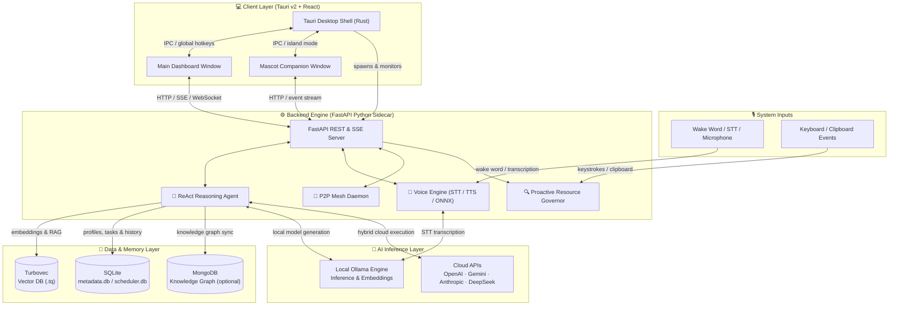

<div align="center">

# 🪐 Meridian-X

### Intelligent Agentic Desktop Workspace Companion

[](https://www.microsoft.com/windows)
[](https://www.python.org)
[](https://tauri.app)
[](https://fastapi.tiangolo.com)
[](https://ollama.com)
[](LICENSE)

**Meridian-X** is an offline-first, agentic desktop AI assistant built on **Tauri v2 + React**, **FastAPI**, and **local LLMs via Ollama**. It runs autonomous ReAct reasoning loops, secures your workspace with multi-tier safety gates, parses documents into a local vector store, and ships a live mascot companion that reacts to your cognitive context — all without sending a single byte to the cloud by default.

[⬇ Download Installer](https://github.com/Aryan4132/Meridian-X/tree/main/executables) · [📖 Documentation](#️-getting-started--installation) · [🛠 Contributing](#-contributing)

</div>

> [!WARNING]
> **Active Development:** Meridian-X is currently under active development. Features, APIs, and schemas are subject to change.

---

## ✨ Key Features

### 🧠 1. ReAct Reasoning Agent Loop & Advanced Critique
Runs an asynchronous **Reasoning → Acting → Observing** loop powered by local models (e.g. `qwen2.5-coder`), streaming live reasoning timelines to the frontend via Server-Sent Events (SSE).

- **Self-Correction Engine**: Intercepts tool calls and heals parameter mismatches using `inspect.signature` against the `TOOL_REGISTRY`.
- **Syntax Validation**: Validates Python via `ast.parse` and JSON via `json.loads` before any file write or execution.
- **Logic Bug Detection**: A fast secondary LLM (`qwen2.5-coder:1.5b`) evaluates scripts for compiler warnings and logic errors, feeding issues back to the loop for self-correction *before* execution.

### ⚡ 2. Speculative Concurrency Filtering
Divides tool execution into two parallel pathways for maximum throughput while maintaining safety.

| Tier | Tools | Execution |
|:---|:---|:---|
| **Tier 0** (Read-Only) | `read_file`, `list_directory`, `search_web`, `search_codebase` | Concurrent via `asyncio.gather()` |
| **Tier ≥ 1** (State-Modifying) | `write_file`, `run_python`, `gui_click` | Sequential — transaction integrity enforced |

### 🦊 3. Interactive Mascot Companion & Island Mode
A dedicated visual companion window anchored to the **bottom-right corner** of your active display. It reflects the agent's cognitive state in real-time through color shifts, kinetic animations, and audio effects:

| State / Indicator | Trigger & Behavior |
|:---|:---|
| 🟢 **Default / Idle** | Cyan glow, calm floating animation; waiting for input or commands. |
| 🟡 **Diagnostic / Working** | Amber glow, spinning outer hexagon rings, pulsing core, and synth ticks; triggered during security audits, codebase diagnostics, self-healing, or tool execution. |
| 🔴 **Disapproving** | Rose/Red glow, rapid horizontal vibration, and lower buzz tones; triggered when a security check fails, or when a tool encounters an execution error. |
| 🟢 **Typing** | Emerald glow and kinetic typewriter vibration; real-time reaction to active keyboard inputs and keystroke processing. |
| 🔵 **Tired / Sleeping** | Indigo glow, slow deep breathing, floating "z" particles, and soft low-frequency oscillator hums; active during Pomodoro breaks or long periods of inactivity. |

Closing the main dashboard **does not shut down the app** — it seamlessly compresses into a floating Island Mode window.

### 🛡️ 4. Security Auditor Consensus & Safety Gates
- **Consensus Checks**: Runs isolated local security audits via `qwen2.5-coder:1.5b` for any Tier 2+ tool invocation.
- **Authorization Gate**: Halts execution for Tier 3+ write/run operations and awaits explicit confirmation from the user in the chat pane.

### 📡 5. P2P Swarm Dashboard & API Control
- Discovers LAN peer nodes via a mesh network daemon.
- View live telemetry — ports, handshake status, connection latency — from a dedicated **P2P Swarm** UI tab.
- Toggle the daemon or trigger manual peer synchronization on-demand.

### 🔋 6. Context-Aware Resource Governor
Automatically suspends background intelligence tasks when:
- System CPU utilization exceeds **85%**
- A heavy foreground process is active: *Valorant, Cyberpunk, Blender, Unity, Unreal Engine, Visual Studio*

### 📄 7. Native Offline RAG Document Parser
Deep-ingests `.txt`, `.md`, `.json`, `.csv`, `.pdf` (via `pypdf`), and `.docx` (via `python-docx`) — chunking, embedding via `nomic-embed-text`, and indexing into **Turbovec** (vector search) and **SQLite** (metadata).

### ✏️ 8. Rich Inline Code Merge Editor
- Interactive diff panel with character/line count metadata.
- **"Revert to Proposal"** button for instant rollback of manual edits to the original AI suggestion.

---

## 🏗️ Architecture



---

## 💻 System Requirements

### Hardware

| Component | Minimum | Recommended |
|:---|:---|:---|
| **CPU** | Intel Core i5 / AMD Ryzen 5 (AVX2 required) | Intel Core i7 / AMD Ryzen 7+ (8+ cores) |
| **RAM** | 8 GB DDR4/DDR5 | 16 GB – 32 GB DDR5 |
| **GPU / VRAM** | Intel Iris Xe / AMD Radeon Vega (shared memory) | NVIDIA RTX 3060/4060+ (8 GB+ dedicated VRAM) |
| **Storage** | 10 GB SSD | 30 GB+ NVMe SSD |
| **Audio** | Standard microphone | Noise-canceling directional mic (required for wake word) |

> [!IMPORTANT]
> **CPU vs. GPU Inference:** CPU-only inference runs at ~2–5 tokens/sec. An NVIDIA GPU with CUDA acceleration targets 30–60 tokens/sec.

> [!TIP]
> **API Key Alternative (Low-Spec Hardware Support):**
> If your system does not meet the local GPU or RAM requirements, you can configure cloud API keys (**Gemini, OpenAI, Anthropic, or DeepSeek**) in the settings panel or `.env` file to offload inference. In this Hybrid Cloud Mode, only light audio preprocessing, local DB indexing, and orchestration run on your machine, making even low-spec or CPU-only hardware completely sufficient.

### Supported OS

| OS | Status |
|:---|:---|
| **Windows 11** (64-bit AMD64) | ✅ Fully Supported |
| **macOS** | ⚠️ Under Active Development (Core sidecar compiles; desktop shell integration is work-in-progress) |
| **Linux** | ⚠️ Under Active Development (Core sidecar compiles; desktop shell integration is work-in-progress) |

---

## 🛠️ Getting Started & Installation

### ⚡ Quick Developer Installer (One-Line Setup)

For a fully automated developer installation on Windows (which installs Python packages, sets up `.env`, compiles front-end modules, and pulls Ollama models), open PowerShell and run:

```powershell
powershell -ExecutionPolicy Bypass -Command "git clone https://github.com/Aryan4132/Meridian-X.git; cd Meridian-X; .\setup.ps1"
```

---

### Option A — Pre-compiled Installers *(Recommended)*

#### ⚡ One-Line App Installer (PowerShell)

To automatically download and launch the Windows setup installer directly from the `executables` folder in the repository, run this command in PowerShell:

```powershell
powershell -ExecutionPolicy Bypass -Command "$url = 'https://github.com/Aryan4132/Meridian-X/raw/main/executables/meridian-x_0.2.0_x64-setup.exe'; $p = Join-Path $env:TEMP 'meridian-x_0.2.0_x64-setup.exe'; Write-Host 'Downloading Meridian-X...'; Invoke-WebRequest -Uri $url -OutFile $p; Start-Process $p -Wait"
```

#### Manual Download & Run

1. **Download** the compiled installer from the `executables` directory:
   [📦 Download Meridian-X Installers (GitHub Directory)](https://github.com/Aryan4132/Meridian-X/tree/main/executables)

2. **Run** your preferred installer from the `executables/` directory:
   - **NSIS Setup EXE** — `meridian-x_0.2.0_x64-setup.exe` — wizard-based setup
   - **MSI Package** — `meridian-x_0.2.0_x64_en-US.msi` — standard Windows installer package

3. **Launch** via the **Meridian-X** desktop shortcut.

---

### Option B — Run from Source *(Developer Mode)*

#### Prerequisites
- **Python 3.10+** (in a virtual environment)
- **Node.js** & **npm**
- **Rust** toolchain (for Tauri)
- **Ollama** running locally

#### 1. Pull Ollama Models

```bash
# ── Minimum Tier (8 GB RAM / CPU-only) ─────────────────────────────
ollama pull qwen2.5-coder:1.5b-instruct
ollama pull moondream:1.8b
ollama pull qwen2.5-coder:1.5b-instruct-q8_0
ollama pull nomic-embed-text

# ── Recommended Tier (16 GB+ RAM / Dedicated GPU) ──────────────────
ollama pull qwen2.5-coder:7b-instruct-q4_K_M
ollama pull llama3.2-vision:11b
ollama pull qwen2.5-coder:1.5b-instruct-q8_0
ollama pull nomic-embed-text
```

#### 2. Configure `.env`

Create `meridian_backend/.env`:

```env
# Core
P2P_SECRET_TOKEN=your-secure-handshake-token
OLLAMA_HOST=http://127.0.0.1:11434
MERIDIAN_MODEL=qwen2.5-coder:7b-instruct-q4_K_M

# Optional Cloud API Keys (Hybrid Mode)
OPENAI_API_KEY=sk-...
ANTHROPIC_API_KEY=sk-ant-...
DEEPSEEK_API_KEY=sk-...
GEMINI_API_KEY=AIzaSy...

# Email (SMTP & IMAP)
SMTP_SERVER=smtp.gmail.com
SMTP_PORT=587
SMTP_EMAIL=your_email@gmail.com
SMTP_PASSWORD=your-app-password
IMAP_SERVER=imap.gmail.com

# MongoDB Graph DB
MONGODB_URI=mongodb://localhost:27017/meridian_kg

# Logging
MERIDIAN_LOG_LEVEL=INFO
```

#### 3. Launch

```bash
# One-command startup (backend + Tauri frontend)
start_meridian.bat
```

> [!NOTE]
> The startup scripts and the React boot sequence actively poll `http://127.0.0.1:4132/api/health` until the FastAPI daemon is responsive before showing the main window — preventing race conditions during boot.

Or run separately in two terminals:

```bash
# Backend
cd meridian_backend
python -m venv venv && venv\Scripts\activate
pip install -r requirements.txt
python api.py

# Frontend
cd meridian_frontend
npm install
npm run tauri dev
```

---

## ⚙️ Post-Installation Configuration

Navigate to the **Settings** gear icon on first launch:

1. **Ollama Host** — defaults to `http://localhost:11434`. Update if Ollama is on a different port/host.
2. **Cloud API Keys** *(optional)* — enter keys for OpenAI, DeepSeek, Gemini, or Anthropic. Available models are dynamically queried once saved.
3. **Model Selection** — choose **Brain**, **Vision**, and **Auditor** models. Toggle *"Show all models"* to use custom or experimental variants.
4. **Email & DB** *(optional)* — configure SMTP/IMAP credentials and MongoDB URI.
5. **Logging** — set log level: `DEBUG`, `INFO`, `WARNING`, `ERROR`, or `CRITICAL`.

### 🔑 API Keys & Integration Guide

To unlock the full potential of Meridian-X, you can configure the following API keys and credentials in the **Settings** panel or directly in your `.env` file:

#### 🧠 LLM Providers (Hybrid Cloud Mode)
If your local hardware runs slowly on CPU-only inference, you can enter API keys for cloud providers to offload LLM tasks:
*   **Gemini API Key** (`GEMINI_API_KEY`): Connects to Google's Gemini models (e.g., `gemini-2.5-flash`). Recommended for extremely fast and high-quality responses.
*   **OpenAI API Key** (`OPENAI_API_KEY`): Connects to OpenAI models (e.g., `gpt-4o`, `gpt-4o-mini`).
*   **Anthropic API Key** (`ANTHROPIC_API_KEY`): Connects to Claude models (e.g., `claude-3-5-sonnet`), excellent for complex coding and refactoring.
*   **DeepSeek API Key** (`DEEPSEEK_API_KEY`): Connects to DeepSeek models (e.g., `deepseek-chat`, `deepseek-coder`).

#### 🔍 Tools & Services
*   **Tavily API Key** (`TAVILY_API_KEY`): Enables high-quality search engine queries, letting the agent search the web autonomously to fetch up-to-date documentation or real-time info.
*   **Vault Key** (`MERIDIAN_VAULT_KEY`): A master passphrase used to encrypt and decrypt sensitive data stored in your local secure vault tool.

#### 📧 Communication & Integrations
*   **SMTP & IMAP Credentials** (`SMTP_EMAIL`, `SMTP_PASSWORD`): Allows the agent to log into your email account to read incoming mail, draft replies, or send notifications.
*   **Discord Bot Token** (`DISCORD_BOT_TOKEN`): Connects the agent to a Discord bot, enabling you to message the agent and run commands from any Discord client.
*   **Telegram Bot Token** (`TELEGRAM_BOT_TOKEN`): Connects the agent to a Telegram bot for remote mobile chat controls.

#### 🗄️ Database Storage
*   **MongoDB URI** (`MONGODB_URI`): Configures a local or remote MongoDB instance to store the agent's long-term factual memories in a structured Knowledge Graph. Core features will gracefully degrade to SQLite if this is omitted.

### Testing Voice Wake Word
1. Enable the **Mascot Voice** toggle in Settings.
2. Say **"Hey Meridian"** — the mascot indicator will animate into listening state.
3. Test: *"Check system health"* or *"Audit workspace safety."*

---

## 📦 Production Builds & Startup

### Building Installers

```bash
cd meridian_frontend
npm run tauri build
```

Outputs to `executables/`:
- `meridian-x_0.2.0_x64-setup.exe` — NSIS wizard installer
- `meridian-x_0.2.0_x64_en-US.msi` — MSI enterprise installer

### Launch on Windows Startup
- **Settings UI**: Toggle **Launch on Startup** in the companion window settings.
- **CLI**: `python setup_startup.py` (disable: `python setup_startup.py --disable`)

The startup script detects the compiled binary at `meridian_frontend/src-tauri/target/release/app.exe`. If present, it boots silently without a dev server. Falls back to development mode if not found.

---

## 🔍 Troubleshooting

<details>
<summary><b>1. Ollama Unreachable</b></summary>

**Symptom:** UI shows *"Ollama server unreachable"* or `httpx.ConnectError: [Errno 61] Connection refused`.

1. Verify Ollama is running: open `http://127.0.0.1:11434` — should return `"Ollama is running"`.
2. Update `OLLAMA_HOST` in `.env` if using a non-default port or remote host.
3. Ensure required models are pulled:
   ```bash
   ollama pull nomic-embed-text
   ollama pull qwen2.5-coder:7b-instruct-q4_K_M
   ollama pull qwen2.5-coder:1.5b-instruct-q8_0
   ```
</details>

<details>
<summary><b>2. SQLite Database Locked</b></summary>

**Symptom:** `sqlite3.OperationalError: database is locked`

Meridian-X enables WAL mode on startup to allow concurrent reads and writes. If the error persists, kill ghost processes:

```powershell
Get-Process -Name python | Stop-Process -Force
```

Ensure only one `api.py` instance is running at a time.
</details>

<details>
<summary><b>3. MongoDB Offline</b></summary>

**Symptom:** `[MongoDB Graph] MongoDB offline, skipped fact saving`

Meridian-X **gracefully degrades** — core functionality continues without MongoDB; only knowledge graph sync is skipped.

- **Windows**: Open `services.msc`, find `MongoDB Server`, click **Start**.
- **Linux/macOS**: `sudo systemctl start mongod`
- Verify port `27017` or update `MONGODB_URI` in `.env`.
</details>

<details>
<summary><b>4. Microphone / Wake Word Not Working</b></summary>

**Symptom:** *"Hey Meridian"* not detected, or `sounddevice`/`pyaudio` exceptions.

1. Check OS mic permissions: **Settings → Privacy & Security → Microphone**.
2. Run `python verify_system.py` to inspect active audio devices.
3. Set your input device to `1 channel, 16-bit, 16000 Hz (CD Quality)` in Windows Sound settings.
</details>

<details>
<summary><b>5. High RAM/CPU Usage & Lag</b></summary>

**Symptom:** System stuttering or lag during inference.

Switch to a smaller quantized model in **Settings** or `.env`:

| Hardware | Brain Model | Vision Model |
|:---|:---|:---|
| 8 GB RAM / No GPU | `qwen2.5-coder:1.5b` | `moondream:1.8b` |
| 16 GB RAM / 6 GB VRAM | `qwen2.5-coder:7b-instruct-q4` | `moondream:1.8b` |
| 32 GB+ RAM / 12 GB+ VRAM | `qwen2.5-coder:14b` | `llama3.2-vision:11b` |
</details>

---

## 🗺️ Roadmap

- [ ] **Multi-Agent Orchestration** — specialized sub-agents per programming language
- [ ] **Enhanced GUI Automation** — deeper Accessibility API integration
- [ ] **Dynamic Plugin Market** — hot-load third-party toolsets at runtime
- [ ] **Temporal Memory Graph** — time-aware knowledge graphs tracking project evolution

---

## 🎗️ Credits & Acknowledgements

Special thanks to the open-source projects and libraries that make **Meridian-X** possible:

- **[Turbovec](https://github.com/RyanCodrai/turbovec)** - An open-source, high-performance local vector database utilizing the TurboQuant quantization algorithm for data-oblivious vector quantization.
- **[Supertonic](https://github.com/supertone-inc/supertonic)** - An ultra-fast, on-device local text-to-speech (TTS) engine built on ONNX Runtime.
- **[Ollama](https://github.com/ollama/ollama)** - The framework driving offline local model deployments, embeddings, and reasoning.
- **[Tauri](https://github.com/tauri-apps/tauri)** - The multi-window frontend desktop wrapper, keeping Meridian-X secure and lightweight.
- **[Faster-Whisper](https://github.com/SYSTRAN/faster-whisper)** - Re-implemented Whisper model utilizing CTranslate2 for lightning-fast voice transcription.
- **[FastAPI](https://github.com/fastapi/fastapi)** - The asynchronous Python backend powering our orchestration API, scheduler, and SSE-based telemetry stream.
- **[Tavily](https://tavily.com)** - Search engine optimized for LLMs, utilized for rich web search results.
- **[DuckDuckGo-Search](https://github.com/deedy5/duckduckgo_search)** - Default fallback library used to perform web queries without requiring external API keys.

---

## 🤝 Contributing

Contributions are welcome! Here's how:

1. Fork the repository
2. Create your feature branch: `git checkout -b feature/my-feature`
3. Commit your changes: `git commit -m 'feat: add my feature'`
4. Push to the branch: `git push origin feature/my-feature`
5. Open a Pull Request

---

<div align="center">

© 2026 Built by **Aryan** · Meridian-X

</div>
