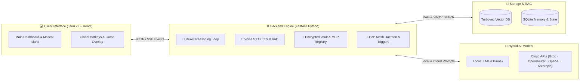

<div align="center">

# 🪐 Meridian-X

### Intelligent Agentic Desktop Workspace Companion

[](https://github.com/Aryan4132/Meridian-X/releases)
[](https://tauri.app)
[](https://www.python.org)
[](https://tauri.app)
[](https://fastapi.tiangolo.com)
[](https://ollama.com)
[](LICENSE)

**Meridian-X** is an offline-first, agentic desktop AI assistant built on **Tauri v2 + React**, **FastAPI**, and **local LLMs via Ollama**. It runs autonomous ReAct reasoning loops, secures your workspace with multi-tier safety gates, parses documents into a local vector store, ships an interactive mascot companion that reacts to your cognitive context, and supports universal cloud API vault integration and Model Context Protocol (MCP) servers.

[⬇ Download Releases](https://github.com/Aryan4132/Meridian-X/releases) · [📖 Documentation](#️-getting-started--installation) · [🛠 Contributing](#-contributing)

</div>

> [!NOTE]
> **v0.3.0 Stable Release:** All 28 Backlog features are implemented, tested (76/76 unit tests passing), and bundled into standalone installers.

---

## ✨ Key Features

### 🧠 1. ReAct Reasoning Agent Loop & Advanced Critique
Runs an asynchronous **Reasoning → Acting → Observing** loop powered by local models (e.g. `qwen2.5-coder`) or cloud LLMs, streaming live reasoning timelines to the frontend via Server-Sent Events (SSE).

- **Self-Correction Engine**: Intercepts tool calls and heals parameter mismatches using `inspect.signature` against the `TOOL_REGISTRY`.
- **Syntax Validation**: Validates Python via `ast.parse` and JSON via `json.loads` before any file write or execution.
- **Logic Bug Detection**: A fast secondary LLM (`qwen2.5-coder:1.5b`) evaluates scripts for compiler warnings and logic errors, feeding issues back to the loop for self-correction *before* execution.

### 🔐 2. Universal Encrypted Secret Vault & Dynamic API Key System
Save and encrypt any third-party API key or cloud secret with AES-GCM encryption in Settings:
- **LLM Providers**: Groq, OpenRouter, Mistral, OpenAI, Anthropic, Gemini, DeepSeek, Together AI, Perplexity.
- **Voice & Speech**: ElevenLabs, Deepgram, Whisper Cloud.
- **Search & Tools**: Tavily, SerpAPI, Replicate, HuggingFace.
- Features mask/unmask key toggles, category badges, and dynamic custom base URL configuration.

### 🔌 3. Model Context Protocol (MCP) Server Registry & Marketplace
- **1-Click MCP Marketplace**: Dynamic installation and registration for featured MCP servers (**GitHub Integration**, **PostgreSQL Engine**, **Slack Messenger**, **Linear Issue Tracker**).
- **Direct Tool Injection**: Connected MCP servers dynamically inject structured tools directly into the agent's reasoning loop.

### 🦊 4. Interactive Mascot Companion & Island Mode
A dedicated visual companion window reflecting cognitive states in real-time (Cyan Idle, Amber Diagnostic, Rose Disapproving, Emerald Typing, Indigo Sleeping).
- **Configurable Island Positioning**: Choose between 6 anchor screen locations (`Top-Center`, `Bottom-Center`, `Top-Right`, `Bottom-Right`, `Top-Left`, `Bottom-Left`).
- **Seamless Compression**: Closing the dashboard compresses Meridian-X into a sleek floating Dynamic Island.

### 🎮 5. Sub-10ms Frameless Game Overlay (`Alt+Space`)
A frameless, semi-transparent HUD overlay triggered via global hotkey (`Alt+Space`), allowing gamers and developers to query AI assistance without leaving full-screen apps or games.

### ⚡ 6. Speculative Concurrency Filtering
Divides tool execution into two parallel pathways for maximum throughput while maintaining safety:
- **Tier 0 (Read-Only)**: `read_file`, `list_directory`, `search_web`, `search_codebase` (Concurrent via `asyncio.gather()`).
- **Tier ≥ 1 (State-Modifying)**: `write_file`, `run_python`, `gui_click` (Sequential transaction enforcement).

### 🛡️ 7. Enterprise Security Safeguards & Hardening (`SEC-01` – `SEC-26`)
- **Global Auth Middleware (`SEC-01`)**: Enforces `X-API-Key` header authentication globally on all FastAPI endpoints with an explicit public whitelist (`/api/health`, `/api/debug/log`).
- **Per-Endpoint Rate Limiting (`SEC-02`)**: Integrated `slowapi` rate limiter (20/min chat, 10/min vault, 60/min general) returning HTTP 429 on breaches.
- **Request Body Size & Input Boundaries (`SEC-03`)**: 10MB payload size limit middleware (`HTTP 413`) and Pydantic `Field(max_length=...)` input string bounds.
- **Machine-Bound Vault Encryption (`SEC-05`)**: HMAC-SHA256 passphrase derivation bound to system identity (`hostname + username`) with automatic legacy vault migration.
- **Prompt Injection Sanitizer Engine (`SEC-08`)**: Pre-processes user prompts and web scrape results to strip jailbreak directives (`"ignore previous instructions"`) and zero-width unicode attacks.
- **Sandbox Code Execution Lockdown (`SEC-10`)**: `MERIDIAN_ALLOW_HOST_CODE_EXEC` gate that blocks un-sandboxed host code execution when Docker containers are absent.
- **Trusted Origin Validation (`SEC-06`)**: Validates `Origin` / `Referer` headers on state-mutating requests against the CORS whitelist.

### 🧠 8. Personal Life Assistant & Memory Engine (`AST-01` – `AST-14`)
- **Personal Knowledge & Preference Graph (`AST-01`)**: Long-term entity-relationship graph storing user habits, coding preferences, and work schedules.
- **Morning Executive Briefing (`AST-02`)**: Automated daily digest covering weather, calendar events, unread notifications, and system health.
- **Smart Workspace Macro Presets ("Modes") (`AST-04`)**: 1-click environment setups ("Dev Mode", "Research Mode", "Gaming Mode").
- **Error-Aware Ghost Assistant (`AST-05`)**: Real-time terminal crash and compiler error detection with 1-click fix recommendations.
- **Continuous 10s Conversation Window (`AST-08`)**: Active post-response listening window enabling natural follow-up questions without re-triggering the wake word.
- **Natural Language Tool Auto-Creator (`AST-13`)**: Meridian writes, validates, and registers its own new Python tools on user request.

### 💻 9. Autonomous AI Software Engineer & MCP Integration (`DEV-01` – `DEV-03`)
- **Autonomous Bug Fixer & Auto-PR Agent (`DEV-01`)**: Runs test suites in background, debugs failures, creates git branches, and commits verified fixes.
- **Meridian-as-an-MCP-Server (`DEV-02`)**: Exposes Meridian tools and memory as an MCP server for external IDEs (VS Code, Cursor, Claude Desktop).
- **Continuous Tech-Debt Radar (`DEV-03`)**: Periodically scans codebase AST for dead code and over-engineered functions with 1-click refactoring.

### 📱 10. Cross-Device Mobile Sync & Personal Finance (`ECO-01` – `FIN-02`)
- **Mobile Companion App & QR P2P Sync (`ECO-01`)**: QR pairing with mobile devices for remote voice commands and camera video streaming.
- **Universal Multi-Device Clipboard (`ECO-02`)**: Encrypted cross-device clipboard sync and drag-and-drop file transfers.
- **AI Game Coach HUD (`GAM-01`)**: Sub-10ms transparent overlay (`Alt+Space`) with real-time game screen OCR strategy tips.
- **Local Subscription & Expense Sentinel (`FIN-01`)**: Private receipt/invoice parser tracking recurring subscriptions and price hikes.

### 🎨 11. Creative AI Studio & Real-Time Call Translator (`CRT-01` – `CRT-03`)
- **Local AI Visual Studio (`CRT-01`)**: Integrated FLUX / ComfyUI pipeline for generating UI mockups, icons, and graphic assets locally.
- **Voice-Guided Slide Deck Generator (`CRT-02`)**: Converts documents, notes, or transcripts into interactive HTML/Reveal.js slide decks.
- **Real-Time Voice Call Translator (`CRT-03`)**: Live 2-way speech translation for multilingual calls with instantaneous translated TTS playback.

### 👁️ 12. Proactive Vision & Multimodal Architecture (`PL-01` – `PL-16`)
- **Facial Recognition & Presence Engine (`PL-01`)**: MediaPipe/OpenCV webcam presence tracking and user authentication.
- **Continuous Ambient Listener (`PL-02`)**: Background VAD (`webrtcvad`) with continuous `faster-whisper` transcription stream.
- **Provider-Aware Vision Routing (`PL-06`)**: Direct image routing to OpenAI (`gpt-4o`), Gemini (`gemini-1.5-flash`), or Anthropic (`claude-3-5-sonnet`).

### ⚙️ 13. Uncluttered 5-Category Tabbed Settings UI
Reorganized configuration interface divided into 5 clean categories:
- `AI Models` · `Mascot & Style` · `Voice & Audio` · `System Guard` · `Integrations`

---

## 🏗️ Architecture


```mermaid
graph LR
    subgraph UI["💻 Client Interface (Tauri v2 + React)"]
        Dash["Main Dashboard & Mascot Island"]
        Hotkeys["Global Hotkeys & Game Overlay"]
    end

    subgraph Engine["⚙️ Backend Engine (FastAPI Python)"]
        Agent["🧠 ReAct Reasoning Loop"]
        Voice["🎤 Voice STT / TTS & VAD"]
        Vault["🔐 Encrypted Vault & MCP Registry"]
        P2P["📡 P2P Mesh Daemon & Triggers"]
    end

    subgraph Storage["💾 Storage & RAG"]
        Turbovec[("Turbovec Vector DB")]
        SQLite[("SQLite Memory & State")]
    end

    subgraph Inference["🤖 Hybrid AI Models"]
        Ollama["Local LLMs (Ollama)"]
        Cloud["Cloud APIs (Groq · OpenRouter · OpenAI · Anthropic)"]
    end

    UI <-->|HTTP / SSE Events| Engine
    Engine <-->|RAG & Vector Search| Storage
    Engine <-->|Local & Cloud Prompts| Inference
```

---

## 💻 System Requirements

### Hardware

| Component | Minimum | Recommended |
|:---|:---|:---|
| **CPU** | Intel Core i5 / AMD Ryzen 5 (AVX2 required) | Intel Core i7 / AMD Ryzen 7+ (8+ cores) |
| **RAM** | 8 GB DDR4/DDR5 | 16 GB – 32 GB DDR5 |
| **GPU / VRAM** | Intel Iris Xe / AMD Radeon Vega (shared memory) | NVIDIA RTX 3060/4060+ (8 GB+ dedicated VRAM) |
| **Storage** | 10 GB SSD | 30 GB+ NVMe SSD |
| **Audio** | Standard microphone | Noise-canceling directional mic (required for wake word) |

> [!IMPORTANT]
> **CPU vs. GPU Inference:** CPU-only inference runs at ~2–5 tokens/sec. An NVIDIA GPU with CUDA acceleration targets 30–60 tokens/sec.

> [!TIP]
> **API Key Alternative (Low-Spec Hardware Support):**
> If your system does not meet the local GPU or RAM requirements, you can configure cloud API keys (**Gemini, OpenAI, Anthropic, or DeepSeek**) in the settings panel or `.env` file to offload inference. In this Hybrid Cloud Mode, only light audio preprocessing, local DB indexing, and orchestration run on your machine, making even low-spec or CPU-only hardware completely sufficient.

### Supported OS

| OS | Status |
|:---|:---|
| **Windows 11** (64-bit AMD64) | ✅ Fully Supported |
| **macOS** (12+ Apple Silicon / Intel) | ✅ Fully Supported |
| **Linux** (Ubuntu / Debian / Arch / Fedora) | ✅ Fully Supported |

---

## 🛠️ Getting Started & Installation

### ⚡ Quick Developer Installer (One-Line Setup)

For a fully automated developer installation on Windows (which installs Python packages, sets up `.env`, compiles front-end modules, and pulls Ollama models), open PowerShell and run:

```powershell
powershell -ExecutionPolicy Bypass -Command "git clone https://github.com/Aryan4132/Meridian-X.git; cd Meridian-X; .\setup.ps1"
```

---

### Option A — Pre-compiled Installers *(Recommended)*

#### ⚡ One-Line App Installer

Run one of the following commands in your terminal to automatically download and launch the latest Windows setup installer:

*   **PowerShell**:
    ```powershell
    powershell -ExecutionPolicy Bypass -Command "irm https://raw.githubusercontent.com/Aryan4132/Meridian-X/main/install.ps1 | iex"
    ```

*   **Command Prompt (CMD)**:
    ```cmd
    curl -sLO https://raw.githubusercontent.com/Aryan4132/Meridian-X/main/install.bat && install.bat
    ```

#### Manual Download & Run

1. **Download** the compiled installer from GitHub Releases:
   [📦 Download Meridian-X Installers (GitHub Releases)](https://github.com/Aryan4132/Meridian-X/releases)

2. **Run** your preferred installer from the release builds:
   - **NSIS Setup EXE** — `meridian-x_0.3.0_x64-setup.exe` — wizard-based setup
   - **MSI Package** — `meridian-x_0.3.0_x64_en-US.msi` — standard Windows installer package

3. **Launch** via the **Meridian-X** desktop shortcut.

---

### Option B — Run from Source *(Developer Mode)*

#### Prerequisites
- **Python 3.10+** (in a virtual environment)
- **Node.js** & **npm**
- **Rust** toolchain (for Tauri)
- **Ollama** running locally

#### 1. Pull Ollama Models

```bash
# ── Minimum Tier (8 GB RAM / CPU-only) ─────────────────────────────
ollama pull qwen2.5-coder:1.5b-instruct
ollama pull moondream:1.8b
ollama pull qwen2.5-coder:1.5b-instruct-q8_0
ollama pull nomic-embed-text

# ── Recommended Tier (16 GB+ RAM / Dedicated GPU) ──────────────────
ollama pull qwen2.5-coder:7b-instruct-q4_K_M
ollama pull llama3.2-vision:11b
ollama pull qwen2.5-coder:1.5b-instruct-q8_0
ollama pull nomic-embed-text
```

#### 2. Configure `.env`

Create `meridian_backend/.env`:

```env
# Core
P2P_SECRET_TOKEN=your-secure-handshake-token
OLLAMA_HOST=http://127.0.0.1:11434
MERIDIAN_MODEL=qwen2.5-coder:7b-instruct-q4_K_M

# Optional Cloud API Keys (Hybrid Mode)
OPENAI_API_KEY=sk-...
ANTHROPIC_API_KEY=sk-ant-...
DEEPSEEK_API_KEY=sk-...
GEMINI_API_KEY=AIzaSy...

# Email (SMTP & IMAP)
SMTP_SERVER=smtp.gmail.com
SMTP_PORT=587
SMTP_EMAIL=your_email@gmail.com
SMTP_PASSWORD=your-app-password
IMAP_SERVER=imap.gmail.com

# MongoDB Graph DB
MONGODB_URI=mongodb://localhost:27017/meridian_kg

# Logging
MERIDIAN_LOG_LEVEL=INFO
```

#### 3. Launch

```bash
# One-command startup (backend + Tauri frontend)
start_meridian.bat
```

> [!NOTE]
> The startup scripts and the React boot sequence actively poll `http://127.0.0.1:4132/api/health` until the FastAPI daemon is responsive before showing the main window — preventing race conditions during boot.

Or run separately in two terminals:

```bash
# Backend
cd meridian_backend
python -m venv venv && venv\Scripts\activate
pip install -r requirements.txt
python api.py

# Frontend
cd meridian_frontend
npm install
npm run tauri dev
```

---

## ⚙️ Post-Installation Configuration

Navigate to the **Settings** gear icon on first launch:

1. **Ollama Host** — defaults to `http://localhost:11434`. Update if Ollama is on a different port/host.
2. **Cloud API Keys** *(optional)* — enter keys for OpenAI, DeepSeek, Gemini, or Anthropic. Available models are dynamically queried once saved.
3. **Model Selection** — choose **Brain**, **Vision**, and **Auditor** models. Toggle *"Show all models"* to use custom or experimental variants.
4. **Email & DB** *(optional)* — configure SMTP/IMAP credentials and MongoDB URI.
5. **Logging** — set log level: `DEBUG`, `INFO`, `WARNING`, `ERROR`, or `CRITICAL`.

### 🔑 API Keys & Integration Guide

To unlock the full potential of Meridian-X, you can configure the following API keys and credentials in the **Settings** panel or directly in your `.env` file:

#### 🧠 LLM Providers (Hybrid Cloud Mode)
If your local hardware runs slowly on CPU-only inference, you can enter API keys in **Settings → AI Models** to offload LLM tasks:
*   **Groq API Key** (`GROQ_API_KEY`): Connects to Llama 3.3 70B & Mixtral models running at 300+ tokens/sec.
*   **OpenRouter API Key** (`OPENROUTER_API_KEY`): Access 100+ cloud models (Claude 3.5, GPT-4o, DeepSeek R1).
*   **Mistral API Key** (`MISTRAL_API_KEY`): Connects to Mistral Large, Codestral, and Pixtral vision models.
*   **Gemini API Key** (`GEMINI_API_KEY`): Connects to Google's Gemini models (e.g., `gemini-1.5-pro`, `gemini-2.0-flash`).
*   **OpenAI API Key** (`OPENAI_API_KEY`): Connects to OpenAI models (e.g., `gpt-4o`, `gpt-4o-mini`, `o3-mini`).
*   **Anthropic API Key** (`ANTHROPIC_API_KEY`): Connects to Claude models (e.g., `claude-3-5-sonnet-20241022`).
*   **DeepSeek API Key** (`DEEPSEEK_API_KEY`): Connects to DeepSeek models (e.g., `deepseek-chat`, `deepseek-reasoner`).

#### 🎙️ Voice & Audio Providers
Configure voice keys in **Settings → Voice & Audio**:
*   **ElevenLabs API Key** (`ELEVENLABS_API_KEY`): High-fidelity neural voice synthesis for mascot responses.
*   **Deepgram API Key** (`DEEPGRAM_API_KEY`): Ultra-low latency cloud speech-to-text transcription.

#### 🔌 Model Context Protocol (MCP) & Tools
Configure tools in **Settings → Integrations**:
*   **MCP Server Marketplace**: 1-click dynamic installation for GitHub, PostgreSQL, Linear, and Slack MCP servers.
*   **Tavily API Key** (`TAVILY_API_KEY`): Enables real-time web search results.
*   **Universal Secret Vault**: AES-GCM encrypted local vault manager for custom secrets.

#### 📧 Communication & Storage
*   **SMTP & IMAP Credentials**: Email notifications, drafting, and inbox reading.
*   **Discord & Telegram Tokens**: Remote command & control bot integration.
*   **MongoDB URI**: Stores long-term factual memories in a Knowledge Graph. Core functions fallback to SQLite if offline.

### Testing Voice Wake Word
1. Enable the **Mascot Voice** toggle in Settings.
2. Say **"Hey Meridian"** — the mascot indicator will animate into listening state.
3. Test: *"Check system health"* or *"Audit workspace safety."*

---

## 📦 Production Builds & Startup

### Building Installers

```bash
cd meridian_frontend
npm run tauri build
```

Outputs to `meridian_frontend/src-tauri/target/release/bundle/`:
- `nsis/meridian-x_0.3.0_x64-setup.exe` — NSIS wizard installer
- `msi/meridian-x_0.3.0_x64_en-US.msi` — MSI enterprise installer

### Launch on Windows Startup
- **Settings UI**: Toggle **Launch on Startup** in the companion window settings.
- **CLI**: `python setup_startup.py` (disable: `python setup_startup.py --disable`)

The startup script detects the compiled binary at `meridian_frontend/src-tauri/target/release/app.exe`. If present, it boots silently without a dev server. Falls back to development mode if not found.

---

## 🔍 Troubleshooting

<details>
<summary><b>1. Ollama Unreachable</b></summary>

**Symptom:** UI shows *"Ollama server unreachable"* or `httpx.ConnectError: [Errno 61] Connection refused`.

1. Verify Ollama is running: open `http://127.0.0.1:11434` — should return `"Ollama is running"`.
2. Update `OLLAMA_HOST` in `.env` if using a non-default port or remote host.
3. Ensure required models are pulled:
   ```bash
   ollama pull nomic-embed-text
   ollama pull qwen2.5-coder:7b-instruct-q4_K_M
   ollama pull qwen2.5-coder:1.5b-instruct-q8_0
   ```
</details>

<details>
<summary><b>2. SQLite Database Locked</b></summary>

**Symptom:** `sqlite3.OperationalError: database is locked`

Meridian-X enables WAL mode on startup to allow concurrent reads and writes. If the error persists, kill ghost processes:

```powershell
Get-Process -Name python | Stop-Process -Force
```

Ensure only one `api.py` instance is running at a time.
</details>

<details>
<summary><b>3. MongoDB Offline</b></summary>

**Symptom:** `[MongoDB Graph] MongoDB offline, skipped fact saving`

Meridian-X **gracefully degrades** — core functionality continues without MongoDB; only knowledge graph sync is skipped.

- **Windows**: Open `services.msc`, find `MongoDB Server`, click **Start**.
- **Linux/macOS**: `sudo systemctl start mongod`
- Verify port `27017` or update `MONGODB_URI` in `.env`.
</details>

<details>
<summary><b>4. Microphone / Wake Word Not Working</b></summary>

**Symptom:** *"Hey Meridian"* not detected, or `sounddevice`/`pyaudio` exceptions.

1. Check OS mic permissions: **Settings → Privacy & Security → Microphone**.
2. Run `python verify_system.py` to inspect active audio devices.
3. Set your input device to `1 channel, 16-bit, 16000 Hz (CD Quality)` in Windows Sound settings.
</details>

<details>
<summary><b>5. High RAM/CPU Usage & Lag</b></summary>

**Symptom:** System stuttering or lag during inference.

Switch to a smaller quantized model in **Settings** or `.env`:

| Hardware | Brain Model | Vision Model |
|:---|:---|:---|
| 8 GB RAM / No GPU | `qwen2.5-coder:1.5b` | `moondream:1.8b` |
| 16 GB RAM / 6 GB VRAM | `qwen2.5-coder:7b-instruct-q4` | `moondream:1.8b` |
| 32 GB+ RAM / 12 GB+ VRAM | `qwen2.5-coder:14b` | `llama3.2-vision:11b` |
</details>

---

## 🗺️ Roadmap

- [x] **Universal Encrypted Secret Vault & Dynamic API Gateway** — AES-GCM credential vault for Groq, OpenRouter, Mistral, ElevenLabs, Deepgram.
- [x] **Model Context Protocol (MCP) Server Marketplace** — 1-click dynamic installation & tool registration.
- [x] **Multi-Agent Swarm Orchestration** — concurrent sub-agents via `asyncio.gather()` with synthesized reporting.
- [x] **Sub-10ms Frameless Game Overlay (`Alt+Space`)** — global hotkey HUD for full-screen games & productivity windows.
- [x] **Proactive Vision & Ambient Multimodal Engine** — real-time facial presence recognition & background audio monitoring.
- [x] **Temporal Memory Graph** — time-aware knowledge graphs tracking project evolution.
- [x] **Enterprise Security Hardening** — HTTP Security Headers Middleware, P2P Peer Auth, SSE Session Integrity Tokens, API Key Rotation Scheduler, Localhost TLS, Dependency Vulnerability Scanner.
- [x] **Adaptive Emotion & Tone Voice Modulation** — real-time sentiment-adaptive TTS voice parameter tuning.
- [x] **Custom Voice Persona Engine** — persistent named voice personas per user or context.
- [x] **Smart Home / Home Assistant Integration** — REST-based smart device control via Home Assistant API.
- [x] **Meeting Transcriber & Note Synthesizer** — structured AI minutes from audio/video meeting recordings.
- [x] **Real-Time Voice Call Translator** — live bidirectional multilingual speech translation with TTS playback.
- [x] **Voice-Guided Presentation Slide Generator** — transforms docs/notes into interactive Reveal.js slide decks.
- [x] **Local AI Visual Studio (`CRT-01`)** — integrated FLUX / ComfyUI local image generation pipeline.
- [x] **Local Subscription & Expense Sentinel** — private receipt parser tracking recurring subscriptions.
- [x] **Autonomous Tech & Market Research Digest** — structured daily tech news digest from curated sources.
- [x] **Security Dashboard UI Panel** — real-time security posture dashboard with live API key rotation controls.
- [x] **Continuous Tech-Debt & Code Smell Radar** — AST-level codebase health scanner with 1-click refactoring.
- [x] **Smart Power & Thermal Profile Switcher** — OS-level CPU/GPU governor preset switching (`performance`, `balanced`, `power-saver`).
- [ ] **iOS / Android Companion App** — native mobile companion with push notification forwarding.

---

## 🎗️ Credits & Acknowledgements

Special thanks to the open-source projects and libraries that make **Meridian-X** possible:

- **[Turbovec](https://github.com/RyanCodrai/turbovec)** - An open-source, high-performance local vector database utilizing the TurboQuant quantization algorithm for data-oblivious vector quantization.
- **[Supertonic](https://github.com/supertone-inc/supertonic)** - An ultra-fast, on-device local text-to-speech (TTS) engine built on ONNX Runtime.
- **[Ollama](https://github.com/ollama/ollama)** - The framework driving offline local model deployments, embeddings, and reasoning.
- **[Tauri](https://github.com/tauri-apps/tauri)** - The multi-window frontend desktop wrapper, keeping Meridian-X secure and lightweight.
- **[Faster-Whisper](https://github.com/SYSTRAN/faster-whisper)** - Re-implemented Whisper model utilizing CTranslate2 for lightning-fast voice transcription.
- **[FastAPI](https://github.com/fastapi/fastapi)** - The asynchronous Python backend powering our orchestration API, scheduler, and SSE-based telemetry stream.
- **[Tavily](https://tavily.com)** - Search engine optimized for LLMs, utilized for rich web search results.
- **[DuckDuckGo-Search](https://github.com/deedy5/duckduckgo_search)** - Default fallback library used to perform web queries without requiring external API keys.

---

## 🤝 Contributing

Contributions are welcome! Here's how:

1. Fork the repository
2. Create your feature branch: `git checkout -b feature/my-feature`
3. Commit your changes: `git commit -m 'feat: add my feature'`
4. Push to the branch: `git push origin feature/my-feature`
5. Open a Pull Request

---

<div align="center">

© 2026 Built by **Aryan** · Meridian-X

</div>
