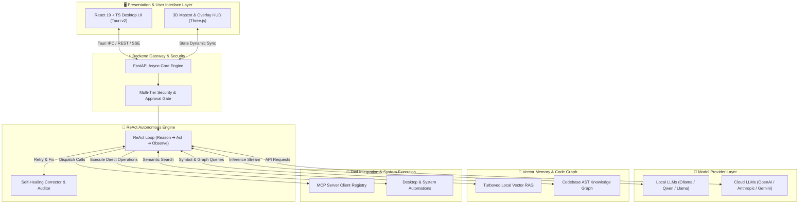

<div align="center">


# 🪐 Meridian-X

### Autonomous Offline-First Desktop AI Agent & Workspace Companion

[](https://github.com/Aryan4132/Meridian-X/releases)
[](https://tauri.app)
[](https://www.python.org)
[](https://tauri.app)
[](https://fastapi.tiangolo.com)
[](LICENSE)

**Meridian-X** is an autonomous, privacy-focused desktop AI agent built on **Tauri v2**, **React 19**, and **FastAPI**. It empowers developers with on-device local ReAct reasoning loops, multi-tier security gates, Model Context Protocol (MCP) server integration, local RAG vector search, and a 3D desktop companion overlay.

[🌐 Releases](https://github.com/Aryan4132/Meridian-X/releases) · [📖 Quick Start](#-quick-start) · [🏗️ Architecture](#%EF%B8%8F-architecture) · [🛡️ Security](#%EF%B8%8F-security--safety-gates)

</div>

---

## ✨ Key Capabilities

### 🧠 Autonomous ReAct Reasoning Engine
- **Reasoning Loop**: Asynchronous *Reason → Act → Observe* execution stream with live Server-Sent Events (SSE).
- **Multi-Model Support**: Powered by local models via Ollama (Qwen2.5-Coder, Llama 3, DeepSeek) or cloud APIs (OpenAI, Anthropic, Gemini, Groq, OpenRouter).
- **Self-Healing & Auto-Correction**: Intercepts tool errors, syntax failures, and parameter mismatches automatically.

### 🛡️ Multi-Tier Safety & Execution Controls
- **Tier 0 (Read-Only)**: Parallel non-mutating operations (`read_file`, `list_directory`, `search_web`).
- **Tier 1 (Safe Mutations)**: Monitored file modifications and structured script runs.
- **Tier 2/3 (High-Risk Operations)**: Enforces interactive human-in-the-loop approval gates before executing desktop actions or system modifications.

### 🔌 Model Context Protocol (MCP) Integration
- **Universal Tool Registry**: Seamlessly connects to external MCP tool servers (GitHub, PostgreSQL, Slack, Linear, Filesystem).
- **Dynamic Tool Injection**: Extends agent capabilities at runtime without restarting the service.

### 🦊 Interactive 3D Mascot & Desktop Overlay
- **Frameless Overlay HUD**: Compact desktop widget floating over applications with global key bindings (`Alt + M`, `Alt + V`).
- **Cognitive State Dynamics**: Real-time visual indicator reflecting agent status (Idle, Thinking, Executing, Error, Success).

### ⚡ Local Vector Memory & Codebase Graph (Neural RAG)
- **Document & Code Ingestion**: Parses PDF, Markdown, Python, DOCX, and JSON into a localized SQLite WAL database with vector embeddings.
- **Code Graph AST**: Parses symbol definitions, callers, callees, and change impact matrices.

---

## 🏗️ Architecture


```mermaid
flowchart TB
    subgraph UI["🖥️ Presentation & User Interface Layer"]
        UI_MAIN["React 19 + TS Desktop UI (Tauri v2)"]
        UI_HUD["3D Mascot & Overlay HUD (Three.js)"]
    end

    subgraph GATEWAY["⚡ Backend Gateway & Security"]
        FASTAPI["FastAPI Async Core Engine"]
        SEC_GATE["Multi-Tier Security & Approval Gate"]
    end

    subgraph CORE["🧠 ReAct Autonomous Engine"]
        REACT["ReAct Loop (Reason ➔ Act ➔ Observe)"]
        HEAL["Self-Healing Corrector & Auditor"]
    end

    subgraph MODELS["🤖 Model Provider Layer"]
        OLLAMA["Local LLMs (Ollama / Qwen / Llama)"]
        CLOUD["Cloud LLMs (OpenAI / Anthropic / Gemini)"]
    end

    subgraph KNOWLEDGE["💾 Vector Memory & Code Graph"]
        VEC_DB["Turbovec Local Vector RAG"]
        AST_GRAPH["Codebase AST Knowledge Graph"]
    end

    subgraph TOOLS["🔌 Tool Integration & System Execution"]
        MCP["MCP Server Client Registry"]
        SYS_OPS["Desktop & System Automations"]
    end

    UI_MAIN <-->|Tauri IPC / REST / SSE| FASTAPI
    UI_HUD <-->|State Dynamic Sync| FASTAPI

    FASTAPI --> SEC_GATE
    SEC_GATE --> REACT

    REACT <-->|Inference Stream| OLLAMA
    REACT <-->|API Requests| CLOUD

    REACT <-->|Semantic Search| VEC_DB
    REACT <-->|Symbol & Graph Queries| AST_GRAPH
    REACT <-->|Retry & Fix| HEAL

    REACT -->|Dispatch Calls| MCP
    REACT -->|Execute Direct Operations| SYS_OPS
```

---

## 🚀 Quick Start

### Prerequisites
- **Python**: 3.11 or higher
- **Node.js**: v20 or higher
- **Ollama** (optional for local LLMs): [ollama.com](https://ollama.com)

### 1. Installation

Clone the repository and run the automated setup script:

```bash
git clone https://github.com/Aryan4132/Meridian-X.git
cd Meridian-X
```

**Windows**:
```powershell
.\start_desktop.bat
```

**Linux / macOS**:
```bash
chmod +x start_desktop.sh
./start_desktop.sh
```

### 2. Development Run

To run the frontend and backend in development mode:

```bash
# Terminal 1: Backend Service
python main.py

# Terminal 2: Frontend Desktop App
cd meridian_frontend
npm install
npm run dev
```

---

## 🛡️ Security & Safety Gates

- **Encrypted Credential Vault**: Third-party API keys are stored in an AES-GCM encrypted local vault using hardware-bound key derivation.
- **Strict Loopback Binding**: Backend REST and WebSocket ports bind strictly to `127.0.0.1`.
- **CORS Protection**: Restricted to local application origins (`tauri://localhost`, `http://localhost:5173`).

---

## 📜 License

Distributed under the MIT License. See [`LICENSE`](LICENSE) for more details.
