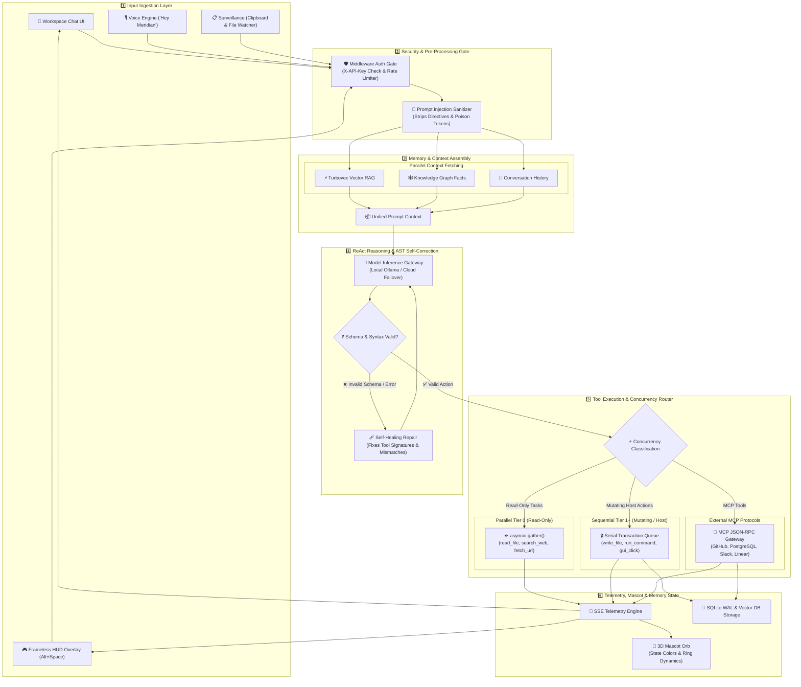

<div align="center">


# 🪐 Meridian-X

### Intelligent Agentic Desktop Workspace Companion

[](https://github.com/Aryan4132/Meridian-X/releases)
[](https://tauri.app)
[](https://www.python.org)
[](https://tauri.app)
[](https://fastapi.tiangolo.com)
[](LICENSE)

**Meridian-X** is an offline-first, agentic desktop AI assistant built on **Tauri v2 + React**, **FastAPI**, and **local LLMs via Ollama**. It runs autonomous ReAct reasoning loops, secures your workspace with multi-tier safety gates, parses documents into a local vector store, and ships an interactive 3D mascot companion with full cloud API vault and MCP server integration.

[⬇ Download](https://github.com/Aryan4132/Meridian-X/releases) · [📖 Installation](#️-getting-started--installation) · [🛠 Contributing](#-contributing)

</div>

---

## ✨ Key Features

### 🧠 ReAct Reasoning Agent
Asynchronous **Reason → Act → Observe** loop powered by local models (`qwen2.5-coder`) or cloud LLMs, streaming live reasoning timelines to the UI via SSE.
- **Self-Correction**: Intercepts tool calls and heals parameter mismatches against the `TOOL_REGISTRY`.
- **Syntax & Logic Validation**: Validates Python/JSON before execution; a fast auditor LLM (`qwen2.5-coder:1.5b`) catches logic bugs before they run.

### 🔐 Encrypted Secret Vault
AES-GCM encrypted credential store for all third-party secrets:
- **LLM Providers**: Groq, OpenRouter, Mistral, OpenAI, Anthropic, Gemini, DeepSeek.
- **Voice**: ElevenLabs, Deepgram. **Search**: Tavily.
- Machine-bound HMAC-SHA256 passphrase derivation tied to `hostname + username`.

### 🔌 MCP Server Registry
- **1-Click Marketplace**: Install and register MCP servers (GitHub, PostgreSQL, Slack, Linear).
- **Direct Tool Injection**: Connected MCP servers inject tools directly into the agent reasoning loop.

### 🦊 Interactive Mascot & Dynamic Island
A 3D orbital-ring companion floating over your desktop that reflects cognitive state in real time.
- **State Colors** (locked, never changes with theme): Blue = Idle · Amber = Working · Red = Failed · Green = Success.
- **Ring Dynamics**: Slow spin (idle) → Fast spin (working) → Frozen (failed).
- **Island Mode**: Closing the dashboard compresses Meridian-X into a sleek floating island.
- **6 Anchor Positions**: Top/Bottom × Left/Center/Right.

### 🎮 Frameless Game Overlay (`Alt+Space`)
Sub-10ms frameless HUD triggered by global hotkey — query AI without leaving full-screen games or apps.

### ⚡ Speculative Concurrency Filtering
Dual-lane tool execution for maximum throughput with safety guarantees:
- **Tier 0 (Read-Only)**: `read_file`, `list_directory`, `search_web` — concurrent via `asyncio.gather()`.
- **Tier ≥ 1 (Mutating)**: `write_file`, `run_python`, `gui_click` — sequential transaction enforcement.

### 🛡️ Enterprise Security (`SEC-01`–`SEC-26`)
- Global `X-API-Key` auth middleware with explicit public whitelist.
- Per-endpoint rate limiting via `slowapi` (20/min chat, 10/min vault).
- Prompt injection sanitizer stripping jailbreak directives and zero-width unicode attacks.
- `MERIDIAN_ALLOW_HOST_CODE_EXEC` sandbox gate blocking un-sandboxed execution.

### 🛡️ Focus Distraction Blocker
Block distracting websites (`YouTube`, `Reddit`, `Twitter/X`, `Twitch`) and background processes (`discord.exe`, `steam.exe`) during Pomodoro focus blocks with active shield status.

### 📋 50-Slot Clipboard Surveillance & Multi-Column Grid
Real-time pastebuffer monitoring with 50 persistent slots, automatic URL/Code classification, 1-click prompt analysis, and SQLite WAL database persistence fallback.

### 🔊 Supertonic Speech & Voice Engine
Local text-to-speech engine featuring 10 distinct speaker voices (Male M1–M5, Female F1–F5), dynamic speech volume control, and audio state-change sound FX.

### 📈 Developer Productivity & Real Stats Engine
Queries live SQLite task logs and Git repository commits to calculate real metrics: `Success Rate`, `Heals Applied`, `Git Commits/Snapshots`, and `Pomodoros Completed`.

### 🌌 Ambient Particle Canvas & Low RAM Optimizer
Dynamic background particle renderer (`AmbientParticles.tsx`) with floating nodes & accent connections, featuring a 1-click **Low RAM Mode** toggle in Settings to conserve memory.

### ⚡ On-Device Turbovec Vector RAG & Knowledge Graph
Local semantic vector store (`Turbovec`) combined with entity-relationship knowledge graph memory for instant sub-millisecond retrieval without sending context to third parties.

### 🎨 11 Selectable Design Styles
Switch themes in **Settings → Mascot & Style** with live visual swatch previews & category filters (`All`, `Dark`, `Light`):

| Theme | Type | Key Accent | Typography |
|---|---|---|---|
| 🪐 Classic Cyber Slate | Dark | Solar Amber `#E8A020` | IBM Plex Mono |
| 🏛️ Art Deco Luxury | Dark | Metallic Gold `#D4AF37` | Playfair Display (Serif) |
| ⚡ Neobrutalism | **Light** | Canary Yellow `#FFDE59` | Space Grotesk |
| 🌆 Cyberpunk Neon | Dark | Neon Magenta `#FF0055` | Orbitron |
| 👾 Retro Synthwave | Dark | Hot Pink `#FF71CE` | VT323 (Pixel Mono) |
| 🖋️ Ink & Slate | Dark | Muted Indigo `#818CF8` | Inter |
| ❄️ Nordic Frost | Dark | Sky Blue `#38BDF8` | DM Sans |
| 🌈 Maximalism | Dark | Vibrant Pink `#FF007A` | Syne |
| 📜 Paper & Ink | **Light** | Terracotta Coral `#D95338` | Lora (Serif) |
| 🌸 Sakura Blossom | **Light** | Rose Quartz `#E85D75` | Outfit |
| ☀️ Solaris Light | **Light** | Cobalt Blue `#2563EB` | DM Sans |

---

## 🏗️ System Architecture


```mermaid
flowchart TD
    %% Layer 1: Trigger & Input Ingestion
    subgraph L1 ["1️⃣ Input Ingestion Layer"]
        U_UI["💬 Workspace Chat UI"]
        U_HUD["🎮 Frameless HUD Overlay (Alt+Space)"]
        U_VOICE["🎙️ Voice Engine ('Hey Meridian')"]
        U_CLIP["📋 Surveillance (Clipboard & File Watcher)"]
    end

    %% Layer 2: Security Gate & Pre-Processing
    subgraph L2 ["2️⃣ Security & Pre-Processing Gate"]
        AUTH["🛡️ Middleware Auth Gate\n(X-API-Key Check & Rate Limiter)"]
        SAN["🧹 Prompt Injection Sanitizer\n(Strips Directives & Poison Tokens)"]
    end

    %% Layer 3: Memory & Context Assembly
    subgraph L3 ["3️⃣ Memory & Context Assembly"]
        subgraph L3_PAR ["Parallel Context Fetching"]
            VEC["⚡ Turbovec Vector RAG"]
            GRAPH["🕸️ Knowledge Graph Facts"]
            HIST["📜 Conversation History"]
        end
        CTX["📦 Unified Prompt Context"]
    end

    %% Layer 4: ReAct Reasoning & Self-Healing
    subgraph L4 ["4️⃣ ReAct Reasoning & AST Self-Correction"]
        LLM["🧠 Model Inference Gateway\n(Local Ollama / Cloud Failover)"]
        CHECK{"❓ Schema & Syntax Valid?"}
        HEAL["🩹 Self-Healing Repair\n(Fixes Tool Signatures & Mismatches)"]
    end

    %% Layer 5: Concurrency Router & Tool Execution
    subgraph L5 ["5️⃣ Tool Execution & Concurrency Router"]
        ROUTER{"⚡ Concurrency Classification"}
        subgraph TIER0 ["Parallel Tier 0 (Read-Only)"]
            T0_EXEC["⏩ asyncio.gather()\n(read_file, search_web, fetch_url)"]
        end
        subgraph TIER1 ["Sequential Tier 1+ (Mutating / Host)"]
            T1_EXEC["🔒 Serial Transaction Queue\n(write_file, run_command, gui_click)"]
        end
        subgraph MCP_SERVERS ["External MCP Protocols"]
            MCP_EXEC["🔌 MCP JSON-RPC Gateway\n(GitHub, PostgreSQL, Slack, Linear)"]
        end
    end

    %% Layer 6: Telemetry, Mascot & State Persistence
    subgraph L6 ["6️⃣ Telemetry, Mascot & Memory State"]
        SSE["📡 SSE Telemetry Engine"]
        MASCOT["🦊 3D Mascot Orb\n(State Colors & Ring Dynamics)"]
        STORE["💾 SQLite WAL & Vector DB Storage"]
    end

    %% Workflow Connections Sequence
    U_UI & U_HUD & U_VOICE & U_CLIP --> AUTH
    AUTH --> SAN
    SAN --> VEC & GRAPH & HIST
    VEC & GRAPH & HIST --> CTX
    CTX --> LLM
    LLM --> CHECK
    CHECK -- "❌ Invalid Schema / Error" --> HEAL
    HEAL --> LLM
    CHECK -- "✅ Valid Action" --> ROUTER

    ROUTER -- "Read-Only Tasks" --> T0_EXEC
    ROUTER -- "Mutating Host Actions" --> T1_EXEC
    ROUTER -- "MCP Tools" --> MCP_EXEC

    T0_EXEC & T1_EXEC & MCP_EXEC --> SSE
    T1_EXEC & MCP_EXEC --> STORE

    SSE --> MASCOT
    SSE --> U_UI
    SSE --> U_HUD
```

### Architectural Layer Breakdown

| Layer | Technologies | Core Responsibility |
|:---|:---|:---|
| **Presentation** | Tauri v2, React 18, Three.js, Lucide, Anime.js | Multi-window shell, 11-style theme switcher, responsive card grids, floating mascot island & HUD |
| **Orchestration** | FastAPI, asyncio, Pydantic v2 | ReAct agent loop, tool parameter auto-correction, speculative concurrency, SSE streaming |
| **Surveillance & Productivity** | Pyperclip, Watchdog, Distraction Shield | 50-slot persistent pastebuffer surveillance, website/process distraction blocker, Pomodoro HUD |
| **Security & Vault** | AES-256-GCM, Cryptography, SlowAPI | Machine-bound passphrase derivation, prompt injection sanitizer (SEC-16), rate limiting, host execution gates |
| **Storage & Memory** | Turbovec, SQLite WAL, MongoDB | On-device vector embeddings, persistent task histories, entity-relationship memory graph |
| **Inference & Voice** | Ollama, Supertonic TTS, Groq, OpenRouter | Offline LLM execution with cloud failover + local 10-voice speech synthesizer |

---

## 💻 System Requirements

| Component | Minimum | Recommended |
|:---|:---|:---|
| **CPU** | Intel i5 / Ryzen 5 (AVX2) | Intel i7 / Ryzen 7+ (8+ cores) |
| **RAM** | 8 GB | 16–32 GB DDR5 |
| **GPU / VRAM** | Intel Iris Xe / Radeon Vega | NVIDIA RTX 3060+ (8 GB+ VRAM) |
| **Storage** | 10 GB SSD | 30 GB+ NVMe |

> [!TIP]
> **No GPU?** Add a cloud API key (Gemini, OpenAI, Groq, etc.) in Settings to offload inference. Only audio preprocessing, DB indexing, and orchestration run locally — making even CPU-only hardware sufficient.

| OS | Status |
|:---|:---|
| **Windows 11** (64-bit) | ✅ Fully Supported |
| **macOS** (12+ Apple Silicon / Intel) | ✅ Fully Supported |
| **Linux** (Ubuntu / Debian / Arch / Fedora) | ✅ Fully Supported |

---

## 🛠️ Getting Started & Installation

### ⚡ One-Line Setup (Windows)

```powershell
powershell -ExecutionPolicy Bypass -Command "irm https://raw.githubusercontent.com/Aryan4132/Meridian-X/main/install.ps1 | iex"
```

Or download the installer from [GitHub Releases](https://github.com/Aryan4132/Meridian-X/releases):
- `meridian-x_0.4.0_x64-setup.exe` — NSIS wizard
- `meridian-x_0.4.0_x64_en-US.msi` — MSI package

---

### Run from Source

**Prerequisites:** Python 3.10+, Node.js, Rust toolchain, Ollama.

#### 1. Pull Ollama Models

```bash
# Minimum (8 GB RAM / CPU-only)
ollama pull qwen2.5-coder:1.5b-instruct
ollama pull moondream:1.8b
ollama pull nomic-embed-text

# Recommended (16 GB+ / Dedicated GPU)
ollama pull qwen2.5-coder:7b-instruct-q4_K_M
ollama pull llama3.2-vision:11b
ollama pull nomic-embed-text
```

#### 2. Configure `.env`

Create `meridian_backend/.env`:

```env
OLLAMA_HOST=http://127.0.0.1:11434
MERIDIAN_MODEL=qwen2.5-coder:7b-instruct-q4_K_M
P2P_SECRET_TOKEN=your-secure-token

# Optional Cloud Keys (Hybrid Mode)
OPENAI_API_KEY=sk-...
GEMINI_API_KEY=AIzaSy...
GROQ_API_KEY=gsk_...
```

#### 3. Launch

```bash
# Windows — one command
start_meridian.bat

# Or separately
# Backend
cd meridian_backend && python api.py

# Frontend
cd meridian_frontend && npm install && npm run tauri dev
```

---

## 🔍 Troubleshooting

<details>
<summary><b>Ollama Unreachable</b></summary>

Verify Ollama is running: open `http://127.0.0.1:11434` — should return `"Ollama is running"`.
Update `OLLAMA_HOST` in `.env` if using a non-default port.

```bash
ollama pull nomic-embed-text
ollama pull qwen2.5-coder:7b-instruct-q4_K_M
```
</details>

<details>
<summary><b>SQLite Database Locked</b></summary>

WAL mode is enabled automatically. If `sqlite3.OperationalError: database is locked` persists, kill ghost processes:

```powershell
Get-Process -Name python | Stop-Process -Force
```
</details>

<details>
<summary><b>High RAM/CPU & Lag</b></summary>

Switch to a smaller model in **Settings** or `.env`:

| Hardware | Brain Model | Vision Model |
|:---|:---|:---|
| 8 GB / No GPU | `qwen2.5-coder:1.5b` | `moondream:1.8b` |
| 16 GB / 6 GB VRAM | `qwen2.5-coder:7b-q4` | `moondream:1.8b` |
| 32 GB+ / 12 GB+ VRAM | `qwen2.5-coder:14b` | `llama3.2-vision:11b` |
</details>

<details>
<summary><b>Microphone / Wake Word Not Working</b></summary>

1. Check OS mic permissions: **Settings → Privacy → Microphone**.
2. Run `python verify_system.py` to inspect audio devices.
3. Set input to `1 channel, 16-bit, 16000 Hz` in OS audio settings.
</details>

<details>
<summary><b>MongoDB Offline</b></summary>

Meridian-X gracefully degrades — core functions continue without MongoDB; only knowledge graph sync is skipped.

- **Windows**: `services.msc` → Start `MongoDB Server`
- **Linux/macOS**: `sudo systemctl start mongod`
</details>

---

## 🎗️ Credits

- **[Turbovec](https://github.com/RyanCodrai/turbovec)** — High-performance local vector database.
- **[Ollama](https://github.com/ollama/ollama)** — Offline local model deployments and embeddings.
- **[Tauri](https://github.com/tauri-apps/tauri)** — Secure, lightweight desktop frontend wrapper.
- **[FastAPI](https://github.com/fastapi/fastapi)** — Async Python backend, scheduler, and SSE telemetry.
- **[Faster-Whisper](https://github.com/SYSTRAN/faster-whisper)** — Fast on-device voice transcription.
- **[Tavily](https://tavily.com)** — LLM-optimized web search engine.

---

## 🤝 Contributing

1. Fork the repository
2. Create your branch: `git checkout -b feature/my-feature`
3. Commit: `git commit -m 'feat: add my feature'`
4. Push & open a Pull Request

---

<div align="center">

© 2026 Built by **Aryan** · Meridian-X

</div>
