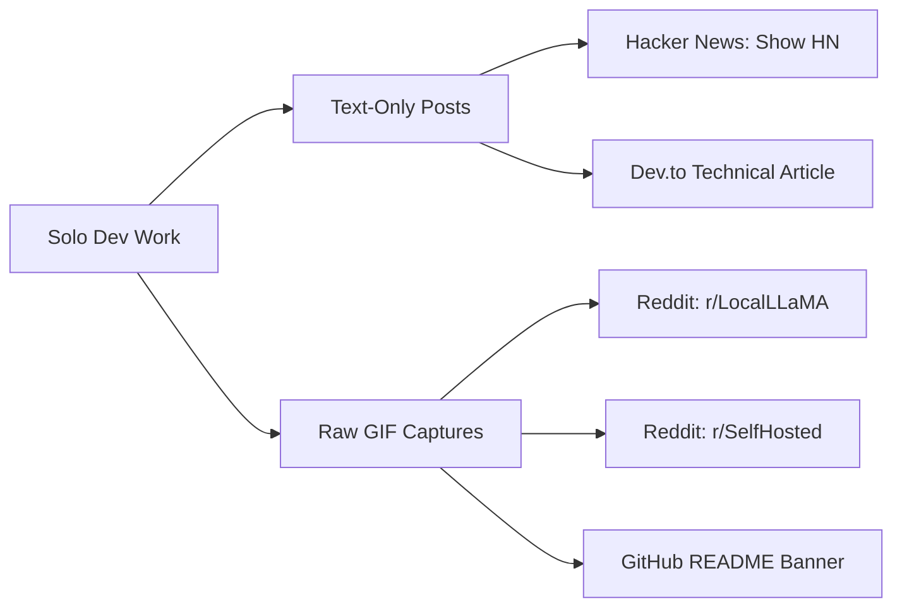

# MERIDIAN-X MARKETING PLAYBOOK (SOLO DEVELOPER EDITION)

> **Goal**: Maximize adoption & GitHub stars as a solo developer with **zero video editing skills** and **zero budget**.  
> **Core Strategy**: Authentic, raw text + GIF screen captures + technical deep dives. Devs trust raw code and real usage over polished marketing.

---

## 1. Zero-Video Asset Toolkit (100% Free & Easy)

### Tools Needed
- **ScreenToGif** (Free Windows app): Record screen directly into animated `.gif`. No editing required.
- **Windows Snipping Tool** (`Win + Shift + S`): Capture clean UI screenshots.
- **Mermaid.js**: Generate architecture diagrams using plain text.

### 3 Simple Assets to Create (Takes 15 Mins Total)

| Asset | Tool | What to Record / Capture | Where to Put It |
| :--- | :--- | :--- | :--- |
| **Asset 1: Main Demo GIF** | ScreenToGif | Open app -> Click voice button -> Ask question -> Show 3D mascot & response. | Top of [README.md](file:///c:/Users/aryan/OneDrive/Dokumen/Mini_Project/Meridian-X/README.md) |
| **Asset 2: Onboarding GIF** | ScreenToGif | Open app first time -> Show hardware auto-detector picking model. | Reddit & Blog posts |
| **Asset 3: UI Screenshot** | Snipping Tool | Dark mode app window showing RAG memory & settings. | Product Hunt / Reddit |

---

## 2. Low-Effort Channel Strategy



### Channel 1: Hacker News ("Show HN") — *Zero Video Required*
- **Why**: HN hates marketing fluff. Pure text + GitHub link gets top traction.
- **Title**: `Show HN: Meridian-X – Open-source local AI desktop assistant with voice & RAG`
- **Post Copy**:
```text
Hi HN,

I'm a solo developer. I built Meridian-X (https://github.com/[YOUR_GITHUB]/Meridian-X) to run a 100% offline AI companion on my desktop.

Why I built it:
Existing tools either rely on cloud APIs, lack voice interaction, or require complex manual setup for local models.

What it does:
- Runs 100% offline via local LLMs (Ollama)
- Built-in local voice engine (TTS + STT)
- Interactive 3D mascot UI (Tauri v2 + Three.js)
- Sub-millisecond vector memory (Turbovec)
- Hardware auto-detection wizard (picks right model based on RAM/VRAM)

Built with Tauri v2, React, FastAPI, Python, SQLite WAL.

Everything is open source. Installers available in releases. Would love your feedback!
```

### Channel 2: Reddit (`r/LocalLLaMA` & `r/SelfHosted`) — *Raw GIF Only*
- **Why**: `r/LocalLLaMA` loves raw screen recordings. High production value often gets downvoted as "sales pitch".
- **Title**: `Built an open-source, 100% offline desktop companion with voice control & local RAG (Solo dev project)`
- **Attach**: Direct `.gif` or unedited `.mp4` screen recording from ScreenToGif.
- **Key Points**: Emphasize **zero cloud data transfer** and **free standalone installer**.

### Channel 3: Dev.to / Hashnode (Technical Storytelling) — *Text + Screenshots*
- **Title**: `How I Built an Offline AI Companion Desktop App as a Solo Developer`
- **Focus**: Share tech hurdles solved:
  1. Packaging FastAPI backend inside Tauri v2.
  2. Optimizing local TTS/STT latency.
  3. Designing hardware detector for non-tech users.

---

## 3. Solo Developer Checklist (1-Hour Launch Plan)

- [ ] **Step 1 (15m)**: Download ScreenToGif -> Record 10-second GIF of app voice interaction -> Save to repo `docs/assets/demo.gif`.
- [ ] **Step 2 (10m)**: Add `demo.gif` to [README.md](file:///c:/Users/aryan/OneDrive/Dokumen/Mini_Project/Meridian-X/README.md).
- [ ] **Step 3 (10m)**: Create GitHub Release tagged `v1.0.0` with `.exe` download attached.
- [ ] **Step 4 (15m)**: Post "Show HN" on Hacker News.
- [ ] **Step 5 (10m)**: Post link + GIF on `r/LocalLLaMA` and `r/SelfHosted`.

---

## 4. Key Takeaway for Solo Devs

> **Do not try to make slick marketing videos.** Developers prefer raw, unedited footage showing actual working software over promo videos. Text + 1 clean GIF is all you need to reach thousands of users.
